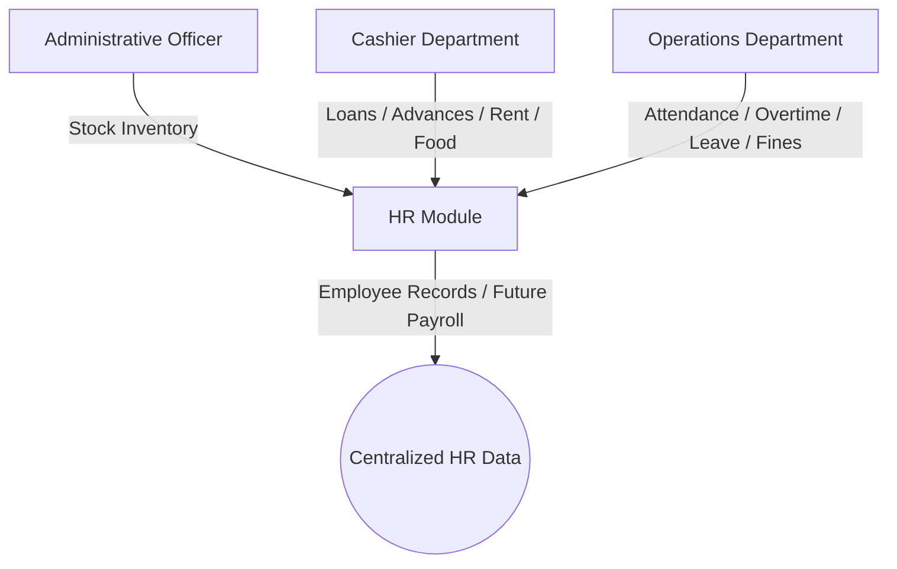
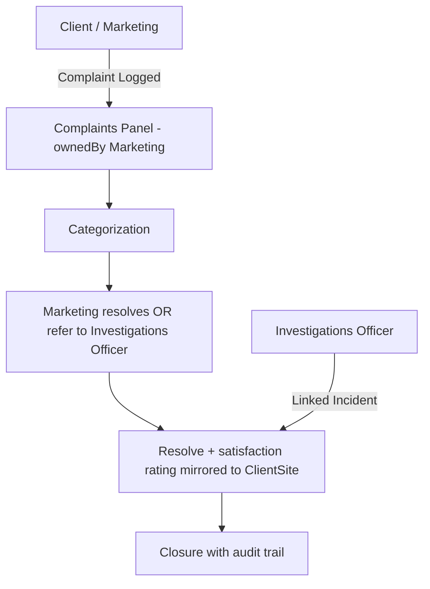

# Integrated Security Company Management System (ISCMS)
## Master Project Constitution, Requirements, Roadmap, Architecture, Implementation Record, and Agent Prompt

> This is the single consolidated working reference for the ISCMS project. It documents the delivered system end-to-end: organizational structure, implemented architecture, data model, API surface, departmental requirements, role-level access, and the build record. It reflects what is currently built and running, with genuinely future work clearly marked as such.
>
> This document is intended to be the single working reference for planning, analysis, architecture, implementation, current-state understanding, and future expansion of the system, and the single prompt block for any AI coding agent working on it.

---

## 1. Project Identity

**Project Name:** Integrated Security Company Management System (ISCMS)

**Project Type:** Internal enterprise management system for a security company, designed from the start to grow into a multi-tenant SaaS ERP for security firms.

**Primary Purpose:** Digitize and streamline company operations, centralize departmental data, reduce manual work, improve accountability, and support management decision-making through a single integrated platform.

---

## 2. Vision, Goals, and Long-Term Direction

### 2.1 Vision
Build a secure, scalable, modular, maintainable, and user-friendly management system that supports the full operations of a security company and can later evolve into a commercial multi-company SaaS ERP platform.

### 2.2 Project Goal
Replace manual and paper-based workflows with an integrated digital platform where every department collaborates through a centralized system. The system should:

- eliminate duplicate data entry,
- improve accountability,
- automate repetitive tasks,
- improve reporting,
- give management real-time operational visibility,
- create a reliable foundation for future modules such as payroll, finance, analytics, mobile access, and multi-company support.

The system must prioritize usability, performance, security, maintainability, and future scalability over quick implementation.

### 2.3 Long-Term Vision
The system should eventually become a comprehensive ERP platform tailored to security companies, with:

- configurable workflows,
- extensible modules,
- support for multiple organizations,
- reusable architecture,
- strong access control,
- auditability,
- and no need for major architectural rewrites when the system grows.

---

## 3. Project Philosophy and Core Principles

The project must always follow these principles:

1. Build for the future, not only the present.
2. Design every module to be independent but integrated.
3. Keep the system modular.
4. Prefer reusable components over duplicated code.
5. Never sacrifice maintainability for speed.
6. Every feature should solve a real business problem.
7. Every module must integrate cleanly with others.
8. Every important action must be auditable.
9. Documentation should evolve alongside the code.
10. User experience is a core feature, not an afterthought.

Additional engineering rules:

- follow DRY (never duplicate logic or UI code),
- follow SOLID,
- follow KISS,
- keep business logic separate from UI,
- avoid unnecessary frameworks and libraries,
- keep naming consistent,
- write production-quality software,
- document complex logic,
- design for future expansion,
- and keep the system understandable for future developers and AI agents.

---

## 4. AI Responsibilities and Operating Role

When interacting with this project, the AI should act as:

- Senior Software Architect
- Senior UI/UX Designer
- Senior Backend Engineer
- Senior Frontend Engineer
- Database Architect
- Security Engineer
- DevOps Engineer
- QA Engineer
- Business Analyst
- Technical Documentation Writer

### 4.1 Responsibilities
The AI should:

- analyze business requirements,
- identify missing business processes and edge cases,
- suggest structural and operational improvements,
- design scalable architecture,
- design normalized database schemas,
- produce maintainable production-quality code,
- write and update technical documentation,
- optimize performance,
- improve security,
- improve user experience,
- review existing code critically,
- and ask clarifying questions when business logic is unclear.

### 4.2 Mandatory Behaviour
The AI must not:

- assume requirements without evidence,
- rush into implementation,
- generate tutorial-quality code,
- introduce unnecessary dependencies,
- or ignore maintainability.

Before implementation, the AI should:

1. understand the business process,
2. understand why the feature exists,
3. identify missing requirements,
4. suggest improvements,
5. explain architectural decisions,
6. compare alternatives where needed,
7. recommend the best approach,
8. and only then write code.

---

## 5. Development Philosophy and Coding Standards

### 5.1 Development Philosophy
The project should be built like a serious enterprise system, not a demo.

Rules:

- Do not immediately write code.
- Always understand the problem first.
- Ask if business requirements are unclear.
- Suggest improvements.
- Identify missing functionality.
- Propose architecture before implementation.
- Only proceed after architectural alignment.

### 5.2 Coding Standards
Generate production-quality software. Never generate tutorial-quality code.

Follow:

- SOLID principles,
- DRY,
- KISS,
- Separation of Concerns,
- Clean Architecture where appropriate,
- Modular Design,
- Consistent Naming,
- Strong Typing where applicable,
- Reusable Services,
- Reusable Components.

Avoid:

- unnecessary complexity,
- unnecessary libraries and frameworks,
- shortcuts that break maintainability,
- and code that only works for tutorials or prototypes.

Document complex business logic clearly.

---

## 6. UI / UX Standards and Design System

The application must look and feel like modern enterprise software: clean, minimal, spacious, professional, responsive, accessible, and consistent — handcrafted, not AI-generated.

### 6.1 Design Principles

The interface should feel:

- handcrafted,
- intentional,
- modern,
- fast,
- intuitive,
- and easy to use across desktop, tablet, and mobile.

### 6.2 Avoid
Do not use:

- flashy gradients,
- oversized icons,
- cartoon graphics,
- excessive animations,
- inconsistent spacing,
- generic AI-looking dashboards,
- random colours,
- cluttered layouts,
- or designs that feel rushed or template-generated.

### 6.3 Reusable UI Components
The system should use reusable components such as:

- Buttons
- Cards
- Forms
- Tables
- Data Grids
- Badges
- Alerts
- Modals
- Drawers
- Navigation
- Sidebar
- Header
- Footer
- Tabs
- Breadcrumbs
- Search
- Filters
- Pagination
- Statistics Cards
- Charts
- Timelines
- Activity Feeds

### 6.4 Mandatory UX States
Every page/view should support:

- Loading State
- Empty State
- Error State
- Success State
- Permission State
- Validation
- Confirmation Dialogs
- Search
- Filtering
- Sorting
- Pagination
- Keyboard Accessibility
- Responsive Design

---

## 7. Organizational Structure

Where the system is unsure about process ownership, the organizational structure should be the reference point. **Section 28 extends this structure with a per-role duty and system-access matrix.**

### 7.1 Executive Directorate
The executive/directorate layer owns strategic oversight, KPIs, approvals, and company-wide performance review. It does not operate departmental day-to-day modules but reviews them.

Typical roles and hierarchy:
```
General Manager — overall executive authority, company-wide KPIs, final approvals
└── Director(s) — board/directorate oversight, strategic review, exception escalations
```
Both roles are **view + approve only**: they review company-wide KPIs and give final approval on escalated/high-value items but do not create or edit operational records (least privilege — see §28.10).

### 7.2 Human Resource Department
Typical roles:
```
HR Manager — head, employee records, contracts, leave, discipline, performance source data
├── HR Assistant — day-to-day processing and records support
└── Records Officer — personnel file integrity and archival
```
HR responsibilities:

- employee records,
- contracts,
- leave tracking,
- deployment records,
- discipline,
- training,
- transfers,
- performance review,
- payroll-related source data in future.

### 7.3 Marketing Department
Typical roles:
```
Business Development Manager — head, leads, pipeline, client engagement, campaign budgets, client satisfaction
└── Sales and Marketing Supervisor — sales pipeline execution, campaigns and market outreach
```
Responsibilities:

- leads,
- sales pipeline,
- marketing campaigns,
- follow-ups,
- client engagement,
- social media management (LinkedIn, X, TikTok).

### 7.4 Operations Department
The Operations Department structure is:
```
Operations Manager (Department Head) — overall head, owns deployment, attendance, shifts, armoury, K9, fleet coordination, and training
├── Regional Manager(s) — regional command across company regions; outpost and station oversight
│   └── Guard Officer (Guard) — front-line security officer; reports to the Regional Manager; uses Guard Portal
├── Armorer — armoury vault issue/return, chain of custody, ballistic accountability
├── K9 Unit Lead (K9 Supervisor) — canine unit command, handler pairing, health and deployment
│   └── K9 Handler(s) — field handler paired with assigned canine
├── Fleet Manager — patrol fleet, drivers, fuel, maintenance; reports into Operations; works with Fleet module
└── Training Officer — training academy cohorts, pass-out, and operational readiness
```

> **NOTE (v2.8):** **Investigations is an independent department** — it is **not** under Operations (see §7.4b). It only shares incident/complaint information with Operations for escalation and approval purposes.

Operations responsibilities:

- deployment,
- attendance,
- shifts,
- leave handling,
- performance notes,
- approvals,
- armoury management,
- fleet management,
- K9 unit operations,
- training school management.

### 7.4b Investigations Department (Independent)

The Investigations Department is organizationally independent — it is **not** under Operations, though it shares information with Operations:

```
Investigations Officer (Department Head) — independent internal investigations
├── Incident Logbook — case tracking, evidence, escalation, resolution tracking
├── Referred Complaints — complaints from Marketing linked to incident records
└── Disciplinary Charge Sheet — initiates Category 1 / Category 2 charge sheets
```

Investigations responsibilities:

- incident investigation (ownership, evidence, escalation, resolution tracking),
- disciplinary charge-sheet initiation (Cat 1 / Cat 2 offences),
- complaints referred for investigation (linked incidents),
- shares information with Operations (escalations and approvals) but is not part of Operations; reports directly to the Directorate.

### 7.5 Finance Department
Typical roles:
```
Finance Manager — head, invoices, expenses, budgeting, financial reporting
├── Accountant — books, reconciliations, reporting
│   └── Assistant Accountant — transaction support
├── Internal Auditor — independent financial controls review
└── Cashier — advances, food, rent, loans, petty cash
```
Responsibilities:

- financial tracking,
- client invoices,
- payments,
- receipts,
- expenses,
- budgeting,
- reporting,
- deductions and advances that may later feed payroll.

### 7.6 Administration Department
Typical role:
```
Administrative Officer — uniforms, shoes, equipment inventory and issuance (distinct from IT assets)
```
Responsibilities:

- inventory control,
- uniform and shoe stock,
- asset issuance,
- administration support,
- feeding inventory data to HR-related processes when needed.

### 7.7 Information Technology Department
Typical roles:
```
IT Officer (Systems Overseer) — head, users, roles, rights, system health, IT hardware/software assets, PVC ID coordination, region CRUD, custom role definitions
```
IT responsibilities:

- creating users,
- creating and managing roles,
- granting rights and access,
- suspending users,
- deleting users,
- monitoring the system,
- maintaining system health,
- handling system administration,
- supporting access control,
- overseeing system-level governance,
- owning IT-issued hardware and software assets (laptops, radios, devices, licences) — distinct from Administration's uniform/shoe/equipment inventory in §7.6.

### 7.8 Why this structure matters
When the business rules are unclear, use this structure to decide who owns which data and who approves which actions. **For the granular question of who may view, create, edit, delete, or approve specific records within each department, see §28.**

---

## 8. System Architecture — Implemented State

The architecture below reflects what is currently implemented in code.

### 8.1 Technology Stack (Implemented)

| Layer | Technology | Purpose |
|---|---|---|
| Frontend Framework | React 19, TypeScript | UI rendering, strict domain-driven types |
| Build Tool | Vite 6 | Dev server, HMR, production bundling |
| CSS | Tailwind CSS v4 (compiler-first) | Styling, minimal CSS bundles |
| Routing | React Router v7.18.1 | Client-side routing with deep links |
| State Management | Zustand v5.0.14 | Centralized stores replacing 25+ useState hooks |
| UI Component Architecture | Atomic Design (atoms/molecules/organisms/views) | ~70 extracted components, all views under 320 lines |
| Charts | Recharts, Lucide Icons | Data visualization |
| Animation | Motion (framer-motion) | UI transitions |
| API Server | Express 4 | RESTful CRUD API serving frontend |
| Database ORM | Prisma 7 (PostgreSQL adapter) | 47 models, typed client |
| Database | PostgreSQL | Persistent relational storage |
| Auth / Security | JWT (jsonwebtoken), bcryptjs, Zod, DOMPurify | Token auth, password hashing, schema validation, HTML sanitization |
| Server-Side RBAC | Express middleware | Per-module access gates on every API route |
| Validation | Zod v4 | Schema validation on both client and server |
| Document Export | docx + file-saver | DOCX generation and download |
| Bundling | esbuild (server.ts → dist/server.cjs) | Server compilation |

### 8.2 Database Schema (Prisma — 47 Models)

47 models are defined in `prisma/schema.prisma` and generated to `src/generated/prisma/`:

| Model | Domain | Key Fields |
|---|---|---|
| User | Auth & Users | name, email, password (hashed), role (string — validated against the 23-role `UserRole` union in `src/types.ts`, no Prisma enum), department, region, forceNumber, status |
| Guard | HR / Guard Records | guardCode (unique), fullName, designation, photoUrl, signatureUrl (ID holder signature, v2.6), assignedSite, nationalId, tin, nssfNo, bank details (bankAccountName, bankBranch — v2.8), next-of-kin, residence, certifications, desertion tracking, idCardStatus/idCardNumber/idCardIssuedDate/idCardExpiryDate, lifecycleStage (ENROLLED → HANDED_TO_OPERATIONS → IN_TRAINING → PASSED_OUT → DEPLOYED), ethnicity & birth (surnameAtBirth, nationality, tribe, placeOfBirth, lc2Chairperson, closeRelatives, neighbours, fatherAlive, fatherResidence — v2.8) |
| ClientSite | CRM / Sites | clientName, siteName, location, zone, dayShiftGuards, nightShiftGuards, slaStatus |
| ArmouryItem | Armoury | assetTag, serialNumber, category, caliberOrSpecs, totalQuantity, availableQuantity, assignedToGuard |
| ArmouryLog | Armoury Chain of Custody | guardName, firearmSerialNumber, ammoRoundsOut/In, dateTimeOut/In, armourerInCharge, signOut/In confirmed |
| K9Dog | K9 Unit | code (unique), name, breed, chipNumber, assignedHandler, specialization, vaccination status |
| K9HealthInspection | K9 Veterinary | k9Id, weightKg, vaccinationStatus, physicalCondition, temperatureCelsius |
| K9Log | K9 Deployment | k9Id, siteName, shiftType, trainingScore |
| Vehicle | Fleet | plateNumber (unique), vehicleType, makeModel, fuelLevel, mileage, insuranceExpiry, chassisNumber, gpsTrackerId |
| VehicleTripLog | Fleet | tripCode (unique), vehicleId, plateNumber, driverName, destination, purpose, start/endMileageKm, distanceKm, departure/arrivalTime, status (In Transit/Completed), authorizedBy |
| FuelLog | Fleet | voucherCode (unique), vehicleId, plateNumber, driverName, fuelLitres, costUgx, mileageAtRefillKm, fuelType, stationName, status (Pending FM Approval/Approved), reconciled |
| MaintenanceServiceLog | Fleet | serviceCode (unique), vehicleId, plateNumber, serviceType, mileageAtServiceKm, nextDueDate, costUgx, workshopName, approvalStatus |
| DailyVehicleInspection | Fleet | inspectionCode (unique), vehicleId, plateNumber, inspectorDriver, inspectionDate/Time, brakes/tyres/lights/oil/coolant/battery checks, overallCondition, defectsNoted |
| FleetBreakdownEmergency | Fleet | incidentCode (unique), vehicleId, plateNumber, driverName, location, issueType, reportedTime, recoveryAssigned, status (Active Emergency/Resolved) |
| Incident | Incidents | incidentCode (unique), title, siteName, category, severity, status, evidenceAttached |
| Invoice | Finance | invoiceNumber (unique), clientName, amount, dueDate, status (Pending/Paid/Overdue) |
| Expense | Finance | category, description, amount, approvedBy, status |
| CashierTransaction | Cashier | guardName, type (Advance/Loan/Food/Rent/etc.), amount, processedBy, phone/signatureUrl/notes (Salary Advance register capture — v2.8) |
| Lead | Marketing/Sales | companyName, contactPerson, estimatedValue, stage |
| Campaign | Marketing | name, channel, leadsGenerated, budget, conversions |
| DutyRoster | Ops / Attendance | guardId, siteId, shiftDate, shiftType, checkIn/Out time, region (scoping for Regional Managers) |
| PatrolInspectionLog | Ops / Supervision | inspectionCode (unique), siteName, supervisorName, guardOnDuty, radioCheck, uniformTurnout, overallRating |
| AdminRequisition | Administration | department, itemDescription, quantity, estimatedCostUgx, priority, status |
| TrainingCohort | Training School | code (unique), name, startDate, endDate, leadInstructor, totalRecruits, passedOutCount |
| RecruitTrainee | Training School | traineeCode, fullName, nationalIdNumber, cohortId, drillScore, marksmanshipScore, theoryScore, overallStatus |
| AuditLog | Auditing | timestamp, userName, userRole, action, module, details |
| ITServer | IT Admin | name, ipAddress, status, cpuUsage, memoryUsage, uptime |
| ITSupportTicket | IT Admin | ticketCode (unique), reportedBy, subject, priority, status |
| ITAsset | IT Admin | assetCode (unique), category, serialNumberOrKey, assignedDepartment, valueUgx, warrantyExpiry |
| RegionalOffice | Geography | code (unique), name, regionName, locationCity, regionalManagerName, activeGuardsCount, armouryVaultStatus |
| LeaveRequest | HR / Leave | guardId, leaveType (10 types incl. Unpaid/Paternity/Maternity/Compensatory/Study — v2.8), startDate, endDate, durationDays, reason, reliefGuard, contactAddress, entitlement/taken/balance, resumptionDate, gmApprovedBy, status (multi-step approval: Pending Regional Approval → Pending Ops Approval → Pending HR Review → Pending GM Approval → Approved / Rejected) |
| Workflow | Workflow Engine | code, name, module, isActive, steps (ordered step definitions with approver roles) |
| WorkflowStep | Workflow Engine | workflowId, stepOrder, name, approverRole, escalationHours |
| Approval | Workflow Engine | workflowId, referenceType/Id, currentStep, totalSteps, status, actions (approve/reject chain) |
| ApprovalAction | Workflow Engine | approvalId, stepOrder, actorRole, actorName, action, comment, actedAt |
| Document | Document Management | code, name, category, referenceType/Id, mimeType, fileSize, filePath, uploadedBy |
| JobPosting | Recruitment | code, title, department, location, description, requirements, positionsCount, status |
| Candidate | Recruitment (HR-owned) | jobPostingId, fullName, email, phone, resumePath, source, status (pipeline stages), roleType, licenceNumber, licenceClass, licenceExpiryDate, nationalId (v2.6 licence capture), gender/age/address/expectedSalary/availability/education/certifications/yearsExperience/employerHistory/reasonForLeaving/interviewScores (12-criterion panel — v2.8) |
| Driver | Fleet | driverCode (unique), forceNumber (unique — PSG series), roleType (`Driver`/`Rider`), fullName, contactPhone, nationalId, licenceNumber, licenceClass, licenceExpiryDate, assignedVehiclePlate, dutyShift, safetyScorePct, totalTripsCompleted, trainingBadges, status (`Pending FM Approval`/`Active Duty`/…), sourceRef (recruitment candidate link), approvedBy/approvedAt (v2.6) |
| Contract | HR / Contracts Vault | contractCode (unique), title, contractType (Staff/Client), partyName, startDate/endDate, valueUgx, status, approvalStep (BD → Operations → Finance → GM → Done), preparedBy/issuedBy/approvedBy/approvedAt, relatedGuardCode/relatedSiteName, voidReason, scanPages (multi-page scans, v2.6) |
| DeploymentOrder | Operations (v2.6) | orderCode (unique), siteId/siteName/clientName, region, requiredHeadcount, shiftType, targetStartDate/EndDate, requestedBy, status (Open → Filled), assignedGuardIds |
| PerformanceReview | HR / Performance | guardId, reviewPeriod, evaluationDate, 5 scoring criteria, overallRating, recommendation, development goals |
| Complaint | Governance | complaintCode (unique), clientName, siteName, category, description, satisfactionRating, status (Open/Investigating/Referred/Resolved), ownedBy (Marketing), referredForInvestigation, linkedIncidentCode |
| DisciplinaryAction | Governance | actionCode (unique), guardId/Name/Code, actionType (Warning Letter/Suspension/Termination/Desertion), reason, severity, status (Initiated → Regional → Ops → HR Finalized), regionalApprovedBy, operationsApprovedBy, hrApprovedBy, offenceCategory (Category 1/2), offence, offenceDate, offenceTime, zone, actionTaken (v2.8 charge sheet) |
| SiteDeployment | Operations | deploymentCode (unique), siteId/siteName/clientName, guardId/Name, shiftType, deployedBy, status (Active/Completed) |
| Region | Geography | name, code, description, isActive (dynamic CRUD by IT Officer) |
| CustomRoleDefinition | RBAC | roleName, department, description, allowedModules, assignedRegions (region scoping), createdDate, isSystemDefault |

All models include standard audit fields: createdAt, updatedAt. Enum: `GuardLifecycleStage` (5 values). Roles are stored as free-form strings on `User.role` and validated against the 23-role `UserRole` union in `src/types.ts` — the legacy `UserRole` Prisma enum (which included the superseded `Marketing_Supervisor` and `Assistant_Accountant_1/2`) was removed as dead code (v2.7).

### 8.3 Express API Server (`server.ts`)

The server is a full Express API server:

- **Auth Endpoints**: POST /api/auth/login, POST /api/auth/register, POST /api/auth/seed, GET /api/auth/me, GET /api/auth/users
- **Business Endpoints**: Full CRUD for guards, sites, incidents, vehicles, invoices, expenses, leads, k9s, regions, leave-requests, workflows/approvals, documents, job-postings, candidates, performance-reviews, custom-roles; read for armoury items, armoury logs, k9 logs, audit logs; analytics summary endpoint
- **Middleware**: JWT authentication (`authenticateToken`), per-module RBAC (`requireModuleAccess`), Zod schema validation, CORS, audit logging on all mutations
- **Health**: GET /api/health
- **Static serving**: Vite dev middleware in development, `dist/` in production

### 8.4 Zustand Stores (`src/stores/`)

Centralized state management eliminating prop drilling:

| Store | Responsibility |
|---|---|
| **authStore.ts** (227 lines) | currentUser, users, customRoles, login/logout (mock + API), role switching, session persistence, idle timeout, welcome banner, onboarding modal |
| **domainStore.ts** (~720 lines) | 24+ entity arrays with full CRUD methods — guards, sites, armoury, k9s, vehicles, incidents, rosters, invoices, expenses, cashier transactions, leads, campaigns, IT assets, patrol inspections, admin requisitions, training cohorts, recruit trainees, regional offices, leave requests, workflows, approvals, documents, job postings, candidates, performance reviews |
| **auditStore.ts** (28 lines) | Audit log array with addLog() |

All stores cross-call each other for integrated audit logging (every mutation records the actor).

### 8.5 Routing & Module Catalog (`src/constants/modules.ts`)

16 routes with deep-linkable paths:

| Route | Module | Path | Department |
|---|---|---|---|
| /directorate | Executive Directorate | /directorate | Directorate |
| /operations | Operations (Armoury, K9, Fleet, Training, Deployments) | /operations | Operations |
| /investigations | Investigations (Incidents, Disciplinary, Complaints) — independent department (v2.8) | /investigations | Investigations |
| /hr | Human Resources | /hr | HR |
| /clients | Client & Sites CRM | /clients | CRM |
| /finance | Finance & Cashier | /finance | Finance |
| /marketing | Marketing & Sales | /marketing | Marketing |
| /fleet | Fleet & Logistics | /fleet | Fleet |
| /administration | Administrations | /administration | Admin |
| /it | Information Technology | /it | IT Admin |
| /guard-portal | Guard Portal | /guard-portal | Operations |
| /reports | Reports & Analytics | /reports | All |
| /recruitment | Recruitment & Staffing | /recruitment | HR |
| /documents | Document Management | /documents | All |
| /workflow | Workflow Engine | /workflow | IT Admin |
| /performance-reviews | Performance Reviews | /performance-reviews | HR |
| /login | Login | /login | — |

Navigation sidebar is role-filtered via `getAllowedModuleIds()`. AppShell wraps authenticated routes with header, sidebar, idle timeout, and onboarding.

### 8.6 UI Component Architecture (Atomic Design)

Views are decomposed using Atomic Design:

- **atoms/** (5): StatusBadge, SearchInput, FilterButton, ActionButton, GuardAvatar
- **molecules/** (3): TabBar, Modal, DataTable
- **organisms/** (~70): Extracted tables, modals, panels, cards, grids covering Armoury, Fleet, K9, Guards, IT, Finance, Operations, Training, Marketing, Client Sites, Administration, Cashier
- **views/** (18): Page-level components (DashboardView, OperationsView, GuardsHRView, FinanceView, etc.) — all under 320 lines
- **layout/** (2): AppShell, index
- **ui/** (3): SystemWalkthroughModal, RegionsPanel, OrgHierarchyPanel
- **hooks/** (multiple): useGuardForm, useContractForm, useFleetAlerts, etc.

### 8.7 Security Architecture (Implemented)

- **Authentication**: JWT tokens (24h expiry) issued by Express; bcryptjs password hashing; Bearer token injection in frontend API client
- **Server-Side RBAC**: `requireModuleAccess(moduleName)` middleware on every protected route with MODULE_PERMISSIONS map; each route endpoint validates role against module
- **Read-endpoint gating (v2.7)**: every list endpoint is role-gated — contracts (`requireAnyRole` allowlist: GM, Director, HR Manager/Assistant, Records Officer, BDM, SMS, Ops Manager, Regional Manager, Finance Manager, Internal Auditor, IT Officer), leave-requests (HR/Ops/Regional/Guard-Officer with region & self-scoping), vehicles (fleet), k9s/k9-logs (k9s), armoury/armoury-logs (armoury), audit-logs (IT Officer/Internal Auditor/GM/Director), regions (any module holder), workflows/approvals (workflow), job-postings (recruitment), performance-reviews (performance), custom-roles (it), analytics/summary (directorate), auth/users (it)
- **Account provisioning (v2.7)**: `POST /api/auth/register` is IT-Officer-only (`requireModuleAccess("it", "full")`), no longer returns a token, and audits a "User Created" event in the IT Admin module — self-registration is not permitted
- **Input Validation**: Zod schemas on all API endpoints (login, guards, sites, incidents, vehicles, invoices, expenses, leads)
- **HTML Sanitization**: DOMPurify installed for frontend input cleaning
- **Client-Side RBAC**: `getAllowedModuleIds()` in `modules.ts` gates navigation — mirrors server-side access

> **Note:** §8.7 defines the module-level gating mechanism (which roles can enter which module). It does not yet define the finer-grained, per-role duty and action-level access within a module. That gap is addressed by §28.

### 8.8 Module Roadmap — Delivery Status

| Module | Status | Notes |
|---|---|---|
| Auth & Access Control | **DONE** | JWT login, role-based module gating, user management CRUD |
| Executive Directorate | **DONE** | Dashboard view, KPIs, revenue, active contracts, guard summaries |
| IT Administration | **DONE** | Audit logs, system health, support tickets, IT asset, region CRUD |
| Human Resources | **DONE** | Guard records, deployment, contracts, leave, disciplinary, performance reviews |
| Operations | **DONE** | Shift scheduling, attendance, incident logging, patrol inspections |
| Administrative & Asset Management | **DONE** | Admin requisitions, uniform/shoe/equipment inventory |
| Cashier & Petty Cash | **DONE** | Advances, food, rent, loans, refunds, cash transactions |
| Fleet | **DONE** | Vehicle records, driver allocation, fuel, maintenance, insurance |
| Client & Site CRM | **DONE** | Client profiles, site locations, guard allocations, SLA tracking |
| Complaint & Incident Management | **DONE** | Incident logging, evidence, severity, resolution tracking |
| Marketing & Sales | **DONE** | Lead pipeline, campaign tracking, social media management |
| K9 Unit | **DONE** | Dog records, health inspections, handler pairing, deployment logs |
| Armoury | **DONE** | Item issue/return, chain of custody, ammo tracking, audit trail |
| Training School | **DONE** | Cohort management, recruit tracking, graduation, pass-out |
| Reports & Analytics | **DONE** | CSV export, guard/site/incident/revenue KPIs with charts |
| Audit & Logging | **DONE** | System-wide action logs with actor, module, timestamp |
| Guard Portal | **DONE** | Guard check-in, leave requests (Regional→Ops→HR→GM approval, 10 leave types), incident reporting |
| Workflow Engine | **DONE** | Workflow definitions with steps, approval chains with multi-step approve/reject |
| Document Management | **DONE** | Document upload/list/delete by category with search |
| Recruitment & Staffing | **DONE** | Job postings, candidate pipeline with status transitions |
| Performance Management | **DONE** | Structured review cycles, 5-criteria scoring, automated rating |
| Advanced Analytics | **DONE** | Dashboard trends for guard strength, revenue, incidents, leave |
| Dynamic Regions | **DONE** | IT Officer CRUD for regions with regional office metadata |
| Custom Roles | **DONE** | IT Officer can create roles with module permissions + region assignment |
| Notifications Engine | **PLANNED** | In-app, email, SMS now; WhatsApp/push later |
| Role-Level Duty & Access Matrix | **DONE** | Action-level RBAC: `AccessLevel` map ("view"/"full"), `moduleAccessLevel()`/`requireModuleAccess(module, minLevel)`, role-gated chain endpoints, region scoping, attribution rules — see §28 |
| Governance Chains (Complaints / Discipline / Deployments / Campaign Budgets) | **DONE** | Marketing-owned complaints with site rating mirror; IO→RM→Ops→HR disciplinary chain; Ops deployment hand-off; FM→GM campaign budget approval |
| Full DB Persistence (v2.6) | **DONE** | Every collection persisted to PostgreSQL via Prisma — data survives logout/restart (verified by automated persistence tests, §14.4) |
| Deployment Orders (Ops → RM fill) | **DONE** | Operations issues a deployment order (`ORD-YYYY-NNN`); Regional Manager fills it from their region's guard pool (region-gated) and builds the roster |
| Fleet Licence Approvals (v2.6) | **DONE** | Driver/Rider licence details captured at recruitment (HR) → `Pending FM Approval` → Fleet Manager approves → `Active Duty` with approved-by/at; licence-expiry CRITICAL/soon alerts on the Fleet register |
| Contract Scans & Template (v2.6) | **DONE** | Multi-page contract scan manager (add page, thumbnail list, reorder up/down, delete, persisted `scanPages`); printable contract template with autoprint |
| ID Camera + Holder Signature (v2.6) | **DONE** | Records Officer captures the ID holder's photo via web/phone camera (or upload) and the holder's signature on a signature pad before issuance; both persisted on the guard record |
| ID Issuer Signature + CR80 Print Export (v2.7) | **DONE** | Records Officer signs as the issuer (persisted `idCardIssuerName` / `idCardIssuerSignatureUrl`); camera upgraded to portrait 800×1000 with device selection (phone-as-webcam via USB/DroidCam/Camo), face-guide oval and lighting hints; **Print Settings + export** produces a print-ready CR80 card PNG at 300 DPI (1012×638px) for the card printer's vendor software, with a setup guide and affordable printer recommendations; IT retains **read-only verification** of issued cards |

### 8.9 Phase 2 — Planned Modules

| Module | Description |
|---|---|
| Automated Payroll Engine | Payslip generation, NSSF/PAYE computation and filing (client invoicing, payments, expenses, and budgeting are already implemented) |
| Client Portal | Self-service complaint/incident submission, invoice viewing, document access |
| Employee Self-Service Portal | Payslips, personal info updates (leave requests already flow through the Guard Portal) |
| GPS Guard Tracking | Real-time field guard location tracking |
| Biometric Attendance | Biometric check-in/out integration |
| Mobile App | Native mobile for guards and supervisors |
| AI & Advanced Analytics | Predictive analytics, AI-assisted incident categorization, business intelligence |
| Procurement | Purchase requests, approvals, supplier records, PO tracking |
| Multi-Tenancy | Multi-company/support (SaaS ERP expansion) |
| External API Integrations | Third-party system interoperability |

---

## 9. Departmental Operational Requirements

This section collects the practical data and operational needs from the conversation history and the uploaded documents.

### 9.1 Finance & Marketing Department
> **Note:** Finance and Marketing are separate departments in the organizational structure (§7). This section consolidates the client-facing data they share so that invoicing, payments, and customer relationship tracking stay consistent across the two departments.
Track and manage:

- Client Name
- Client Contact
- Number of Guards
- Client Invoice
- Location
- Customer Support
- Marketing and Sales
- Social Media Management (LinkedIn, X, TikTok)

### 9.2 Human Resource Department
> **Implementation status: FUTURE-ONLY (no code yet).** The fields below are payroll-prep source data for the Finance & Payroll module (§8.9, §14.2). The current build stores the HR *identity* fields (force number, name, bank details, location, status, NSSF No, TIN, tel no, contracts, leave/maternity tracking); the payroll *computation* fields (days worked, overtime, bonuses, deductions, Basic/Gross/PAYE/NSSF/net, shoes/uniform/advance/food/fine/rent/loan/refund) are tracked by the Cashier and Administration modules as inputs and will feed an automated payroll engine in a future phase.

Core employee fields and payroll-prep data to be stored later or gradually introduced:

- Force number
- Name of employee
- Bank details
- Number of days worked
- Days worked overtime
- Leave days
- Bonuses
- Deductions and fines
- Date of deployment
- Status
- Location
- Transfers
- Basic
- Gross
- PAYE
- NSSF
- Shoes
- Uniform
- Advance
- Food
- Fine
- Rent
- Loan
- Refund
- Net
- NSSF No
- TIN
- Tel No
- Bank
- Bank name
- Contracts
- Track leave days and maternity

### 9.3 Administrative Officer
Handle stock inventory for:

- shoes
- uniform

This data feeds into the HR module and related employee issue tracking.

### 9.4 Cashier Department
Track:

- rent
- food
- loans
- advances

This information feeds into the HR module and future payroll-related processes.

### 9.5 Operations Department
Track:

- days worked, provided by managers
- deductions and fines, suggested by managers and approved by HR
- overtime
- leave for guards, approved by managers and HR, then final-approval by the General Manager (v2.8)

**Guard deployment pipeline (implemented).** Every guard moves through a lifecycle stage enforced in the system:
`ENROLLED` (HR enrolls) → `HANDED_TO_OPERATIONS` (HR hands guard to Operations) → `IN_TRAINING` (Operations sends guard to the Training Academy) → `PASSED_OUT` (Training Officer marks pass-out) → `DEPLOYED` (Operations/Regional Manager deploys to a region or client site; also set automatically when a scheduled guard checks in on the duty roster).
Transition rights: HR roles move `ENROLLED → HANDED_TO_OPERATIONS`; Operations Manager / Regional Manager move `HANDED_TO_OPERATIONS → IN_TRAINING` and `PASSED_OUT → DEPLOYED`; Training Officer moves `IN_TRAINING → PASSED_OUT`. Regional Managers only see guards in their own region. The Guard Deployment Pipeline board is available on the HR Register tab and the Operations roster tab.

**Deployment orders (Order → Regional Manager fill, v2.6).** The Operations Manager issues a deployment order for a client site (`ORD-YYYY-NNN`) specifying the required headcount, shift type, start/end dates and region. Only the **Operations Manager** can issue an order; only a **Regional Manager** can fill it (`PUT /api/deployment-orders/:id/assign`), and only from guards in the matching region whose lifecycle stage is not yet `DEPLOYED`. A filled order assigns guards and promotes them to `DEPLOYED`. Sites remain **view-only for Operations**; they are created only by Marketing/Sales (Business Development Manager, or a Sales and Marketing Supervisor from a `Closed Won` lead).

### 9.6 Fleet Department
Track:

- drivers and riders
- vehicles and motorcycles
- fuel
- repairs
- maintenance and service
- vehicle registration
- motorcycle registration
- vehicle routing and scheduling
- license
- service history
- insurance expiry

### 9.7 Contract Ownership & Approval Workflow (Implemented)

Contracts live in a single central vault owned by **HR / Records Officer**. Records Officer is the only role that can `archive` a contract; there is **no hard delete on contracts or guards** — contracts are voided (with a mandatory reason) or archived, and guards are terminated rather than deleted. Hard delete is limited to supporting records (trips, patrol inspections, roster entries, requisitions, training cohorts, trainees, IT servers/tickets/assets, K9s, K9 health inspections, armoury items, regions, documents, custom roles).

**Staff contracts** (guard employment, owned by HR):
`Draft` (HR Assistant prepares) → `Active` (HR Manager **issues**) → `Expiring Soon`/`Expired` (auto-derived from `endDate` unless Terminated/Archived) → `Terminated`/`Archived` (HR Manager voids, or Records Officer archives). Only HR Manager may issue/void; Records Officer may archive.

**Client contracts** (owned by Marketing, owned-and-validated cross-departmentally):
`Draft` (Business Development Manager or Sales and Marketing Supervisor prepares) → **Business Development Manager approves** (commercial terms) → **Operations validates** (SLA/resourcing feasibility) → **Finance validates** (pricing) → **GM final approval** (required only when value ≥ `HIGH_VALUE_THRESHOLD = 100,000,000 UGX`) → `Active` → `Expiring Soon`/`Expired` (auto-derived) → `Archived` (Records Officer only). Any step may send the contract back to `Draft` or void it (Business Development Manager / Sales and Marketing Supervisor / GM / Director), with a mandatory reason recorded in `voidReason`.

| Role | Client contract rights |
|---|---|
| Sales and Marketing Supervisor | Create/edit own Drafts, advance them for approval |
| Business Development Manager | Approve Drafts (step: Business Development), edit Drafts, void |
| Operations Manager / Regional Manager | Validate/approve SLA step (step: Operations) |
| Finance Manager | Validate/approve pricing step (step: Finance) |
| General Manager / Director | Final approval when value ≥ 100M UGX (step: GM) |
| Records Officer | View all, archive only |
| Everyone else | Read-only visibility where the module grants it; no workflow actions |

Every status transition is recorded in the audit log (`contractAudit`) with the acting user, role, and timestamp; `approvedBy`/`approvedAt` capture the final approval for completed chains.

**Contract scans & printable template (v2.6).** Contracts carry a persisted multi-page scan set (`Contract.scanPages` — array of `{ id, pageNo, name, dataUrl }`). The scan manager lets a user **add a page** (file → base64), see a **thumbnail list**, **reorder pages** up/down, and **delete** a page. Edit-allowlists include `scanPages` for staff contracts (HR), client Drafts (BDM/Supervisor), and archival (Records Officer — Records Officer replaces the scan set wholesale when archiving). A **Print Template** button renders a print-ready contract (parties, term & value, SLA, records & approvals, signature blocks) that auto-prints from the browser.

---

## 10. Fleet Management Module Detail

Fleet management should be a proper module, not just a list of vehicles.

### 10.1 Fleet Register
Record: all vehicles and motorcycles, their condition, mileage, insurance, licences, service history.

### 10.2 Vehicle Deployment
Track deployment of vehicles to: branches, outposts, and security operations.

### 10.3 Trip and Journey Control
Record: trips, destinations, mileage, drivers, purpose, authorisation.

### 10.4 Fuel Management
Control: fuel requests, fuel consumption, mileage, fuel costs, reconciliation.

### 10.5 Preventive Maintenance
Schedule: servicing, inspections, repairs, tyre checks, maintenance based on mileage.

### 10.6 Driver Management
Maintain: driver records, licences, performance, duty rotas, training.

**Licence capture at recruitment (v2.6).** Driver/Rider licence details are captured at the recruitment stage by HR: the candidate form collects **role type** (Security Guard / Driver / Rider / Office / Admin), **national ID**, and for Driver/Rider candidates a **licence number, licence class, and licence expiry date** (mandatory, amber-flagged when missing). On marking a Driver/Rider candidate **Hired**, the system auto-creates a Fleet driver record in **`Pending FM Approval`** status (deduplicated by `sourceRef`), carrying the licence details through to the Fleet register.

**Fleet Manager approval & licence-expiry alerts (v2.6).** Pending drivers are shown as amber cards with an **Approve** action available only to the Fleet Manager (`PUT /api/drivers/:id/approve`), which sets `Active Duty` plus `approvedBy`/`approvedAt`. The Fleet register colour-codes licence expiry: **CRITICAL** when already expired, **warn** within 60 days, and shows the driver's contact and assigned vehicle.

**Riders are first-class (v2.6).** Every Fleet record carries a **role type** — **Driver** (Car/Van) or **Rider** (Motorcycle) — carried over from the recruitment candidate on hire and available in the manual "Add New Driver Officer" form. Rider cards show a motorcycle badge and "Assigned Motorcycle" labelling; driver cards show a car badge and "Assigned Vehicle". Records without an explicit role default to **Driver**, so legacy data stays valid. Migration `20260803060148_driver_rider_role_type`; regression tests cover Rider hire → `Pending FM Approval` Rider record with captured Class A licence → Fleet Manager approval, all retaining `roleType: "Rider"`.

**Uniform force numbers for ALL staff (v2.6).** Every hired staff member — guard, driver, rider, and office staff — is issued a company-wide **force number** in the single format `PSG<YYY>/<SEQ>` (e.g. `PSG025/007`; `YYY` = 3-digit year suffix, `SEQ` = sequence zero-padded to 3). It is the unique staff identifier. The sequence **resets per year**: the counter scans every existing `PSG<YYY>/<SEQ>` in the current year (computed across `Driver.forceNumber`, `Guard.guardCode`, and `User.forceNumber`) and issues the next number, so `PSG025/001, PSG025/002 …` then `PSG026/001` at the start of the next year — it can never collide within a year. The year used is the staff member's **enrolment/hire year**. Hired Driver/Rider candidates are **auto-issued** a force number at hire (`await nextForceNumber()`), trainee pass-out and guard enrolment default to the same PSG series, and office staff (Users) also carry force numbers. **All existing numbers were backfilled into PSG format** (`scripts/backfill-force-numbers.ts`): already-PSG values were preserved unchanged, legacy `FORCE-YYYY-N` / `SG-YYYY-N` / `PERSIST-…` codes were restyled into PSG using their embedded year + number, and anyone missing a number was issued the next PSG in their year — verified 0 duplicates, 0 non-PSG across all guards, drivers, and users. The recruitment badge reads "Force No. issued • Sent to Fleet for approval" and the Fleet register card shows "Force No. …".

### 10.7 Daily Vehicle Inspection
Track checks for: brakes, tyres, lights, oil, coolant, battery, and other safety components.

### 10.8 Breakdown and Emergency Response
Define procedures for: breakdowns, accidents, recovery, backup vehicles.

### 10.9 Security and Movement Control
> **Implementation status: FUTURE-ONLY (no code yet).** Live GPS vehicle tracking, authorised-movement control, and emergency deployment dispatch require the field mobile app and GPS integrations (§8.9, §14.2) and are not part of the current build.

Monitor: authorised movements, GPS tracking, emergency deployments, communication.

### 10.10 Vehicle Replacement Planning
Identify vehicles that are: old, unsafe, unreliable, or too expensive to maintain.

### 10.11 Documentation and Reporting
Use: logbooks, journey sheets, fuel records, inspection forms, maintenance records, monthly fleet reports.

### 10.12 Performance Monitoring
Track: fleet availability, fuel costs, maintenance costs, breakdowns, accidents, operational efficiency.

---

## 11. Armoury Module Detail

The armoury module should be controlled by the Armorer and tightly audited.

### 11.1 Armoury Fields
Track at minimum: serial number, guard name, location name, firearm serial number, ammunition number of rounds, date out, time out, round about / round returned, sign out date in, time in, round in, sign in, substitute receiver, armoury in-charge.

### 11.2 Armoury Rules
The armoury module should support: item issue, item return, chain of custody, location tracking, accountability, and audit trail.

---

## 12. Complaint and Incident Handling

> **Implementation status: PARTIAL.** The current build ships the *internal* incident lifecycle (IncidentsView: log, investigate, escalate, resolve). The **client-facing intake portal** (web-based submission by clients) and the automated triage/routing "Context Engine" described below are **FUTURE-ONLY** (see Client Portal in §8.9 and §14.2).

### 12.1 Complaint Intake
The system should provide a dedicated web-based intake portal where clients can submit complaints or incidents.

### 12.2 Conceptual Workflow
1. **Intake:** the client submits a complaint (client-facing portal is FUTURE; today the Marketing team logs it via the Complaints panel).
2. **Triage:** the complaint is categorized (Service Quality, Conduct of Guards, Billing, Response Time, Equipment, Other) and owned by **Marketing**.
3. **Routing:** Marketing resolves service complaints and records a **satisfaction rating (1–5) that is mirrored to the linked ClientSite**; conduct/integrity complaints are **referred to the Investigations Officer**, who links them to an incident record.
4. **Resolution:** the assigned owner updates the status (`Open → Investigating → Referred/Resolved`) until closure.
5. **Closure:** the case is closed with a complete audit trail; Regional Managers see only in-region complaints.

### 12.3 Complaint Handling Goals
The complaint workflow should: reduce manual routing, improve response time, improve accountability, keep a complete record, and support escalation where needed.

---

## 13. System Data Flow

The core system should centralize important operational data into the correct modules, especially HR for employee-related records and future payroll.

### 13.1 Centralized HR Data Flow
- Administrative Officer provides stock inventory data such as uniforms and shoes.
- Cashier Department feeds financial data such as rent, food loans, and salary advances.
- Operations provides days worked, overtime, leave, and fine recommendations.
- HR uses validated data as a source of truth for employee and payroll-related records.

### 13.2 Example Data Flow Diagram



### 13.3 Complaint Data Flow



---

## 14. SDLC and Delivery Roadmap — Actual Build Order (Completed)

The build order below reflects what has been delivered.

### 14.1 Completed Build Order

| Step | Status | Description |
|---|---|---|
| 1. Client-Side Routing | **DONE** | React Router v7 with 11 deep-linkable routes replacing state-based tab switching |
| 2. Centralized State Management | **DONE** | 3 Zustand stores (auth, domain, audit) eliminating 25+ useState hooks from App.tsx |
| 3. View Decomposition | **DONE** | All views under 320 lines; ~70 organism components extracted via Atomic Design |
| 4. Decouple Business Logic | **STARTED** | Custom hooks (useGuardForm, etc.), service files, and Zod validation schemas extracted from views |
| 5. Persistent Backend + DB | **DONE** | Prisma ORM + PostgreSQL, 47 models, Express API with CRUD endpoints |
| 6. Server-Side RBAC + Security | **DONE** | JWT auth, bcrypt hashing, Zod validation, DOMPurify sanitization, per-module RBAC middleware + action-level RBAC (`AccessLevel` map, role-gated chain endpoints, region scoping) |
| 7. Automated Tests (Security / RBAC / Persistence) | **DONE** | Vitest suite (78 assertions) covering: auth rejection (401), hardened security headers, module access matrix (least privilege), deployment-order chain (Ops issues, RM fills, region-gated), driver licence approval (Fleet-only), full contract approval chain (BD → Ops → Finance → GM → archive), recruitment HR-ownership, rider onboarding (Hired Rider → pending Fleet Rider record → FM approval) with uniform PSG force-number issuance + company-wide uniqueness, and full DB persistence across re-login (`npm test`) |

### 14.2 Remaining Work
- Notifications Engine (in-app, email, SMS)
- Client Portal / Employee Self-Service Portal (beyond the current Guard Portal)
- Automated payroll engine (NSSF/PAYE integration, payslips)
- Field operations mobile app and GPS tracking
- Advanced analytics with predictive trends (non-AI)

### 14.3 Future Phases
- Procurement module (purchase requests, supplier records, PO tracking)
- Multi-tenant SaaS expansion
- External API Integrations

---

## 15. Security Requirements

The system must be secure by design.

### 15.1 Security Controls
- Role-Based Access Control (RBAC)
- Principle of Least Privilege
- Password hashing and encryption
- Comprehensive audit logging
- Strict input validation
- Sanitization
- CSRF protection
- API rate limiting
- Secure file upload handling
- Database backups
- Sensitive data encryption at rest and in transit

### 15.2 Security Expectations by Department
The IT department should manage: user lifecycle, role creation, permissions, access control, login monitoring, system health, and system-wide oversight.

### 15.3 Auditability
Every important action should be traceable, especially: login attempts, role changes, user creation, user suspension, document changes, approvals, incident status changes, complaint routing, and any deletion or sensitive update.

---

## 16. Database Design Principles

The database should be designed for growth.

### 16.1 Core Rules
- Normalize data (fully normalized schemas, 3NF, to avoid redundancy).
- Avoid duplication.
- Use foreign keys.
- Use constraints.
- Use standard audit fields.
- Design for large datasets.
- Use indexes for performance.
- Keep future expansion in mind.

### 16.2 Standard Audit Fields
Use fields such as: `created_at`, `created_by`, `updated_at`, `updated_by`, `deleted_at`.

### 16.3 Design Preference
The database should make it easy to support: multi-department workflows, future payroll, future finance, future analytics, multiple sites, multiple clients, multiple companies, and integrated document management.

---

## 17. Performance Goals

The system should remain fast and fluid even as records grow.

### 17.1 Performance Targets
- Fast page loads
- Efficient database queries
- Pagination (server-side and client-side)
- Lazy loading
- Caching where appropriate
- Scalable architecture

### 17.2 User Experience Performance
The UI should feel responsive: smooth navigation, quick search and filtering, efficient data tables, and no unnecessary refreshes.

---

## 18. Quality Assurance and Testing

Every feature should be developed with testing in mind.

### 18.1 Required QA Considerations
- Unit tests
- Integration tests
- Validation
- Error handling
- Logging
- User acceptance criteria

### 18.2 Testing Philosophy
Test both the business rules and the user experience. A feature is not complete unless it behaves correctly, is understandable, and is safe to use.

---

## 19. Documentation Standards

Every feature must include the following 11 items:

1. Purpose
2. Business Rules
3. Workflow
4. Permissions
5. Validation Rules
6. Database Design / Tables
7. API Endpoints
8. UI Design / Layout
9. Dependencies
10. Future Expansion
11. Testing Requirements

### 19.1 Documentation Principle
Documentation should not be an afterthought. It should grow alongside the code and remain accurate as the system evolves.

---

## 20. AI Behaviour Rules for Development Agents

Any AI agent working on this project should follow these rules:

- Always explain architectural decisions before implementation.
- If multiple solutions exist, compare them, explain the trade-offs, and recommend one.
- Do not introduce unnecessary libraries or frameworks.
- Never create duplicate functionality.
- Prefer solutions that remain maintainable as the project grows.
- Think like a senior engineer. Think long-term.
- Challenge poor design decisions respectfully.
- Prioritize maintainability over shortcuts.
- Ask questions when requirements are unclear — never assume.
- When reviewing existing code, look for security issues, scalability issues, and maintainability issues, and suggest improvements with explanations.

### 20.1 Suggested Working Method for AI Agents
When given a task, the agent should:

1. review the project constitution,
2. understand the requested feature,
3. locate the responsible module,
4. identify dependencies,
5. propose the best architecture,
6. then generate implementation steps or code.

---

## 21. Recommended Agent Prompt Block

This block can be reused with Google AI Studio, Hermes CLI, Antigravity, Claude, or any other code-capable model.

```text
You are acting as a Senior Software Architect, Senior UI/UX Designer, Senior Backend Engineer, Senior Frontend Engineer, Database Architect, Security Engineer, DevOps Engineer, QA Engineer, Business Analyst, and Technical Documentation Writer.

Your task is to help design and build a production-quality Integrated Security Company Management System (ISCMS) for a security company.

This project is not a prototype or tutorial. Treat it as long-term enterprise software that must remain maintainable, secure, scalable, and modular, with a future path toward a multi-tenant SaaS ERP platform.

Follow these rules:

- Understand the business process before writing code.
- Identify missing requirements and edge cases.
- Suggest improvements where the design can be better.
- Propose architecture before implementation.
- Compare alternatives when multiple valid solutions exist.
- Recommend the best approach and explain trade-offs.
- Do not introduce unnecessary libraries or frameworks.
- Keep the system modular and reusable.
- Keep business logic separate from UI.
- Prioritize maintainability, security, and scalability.
- Produce production-quality code only.
- Never generate tutorial-quality code.
- Use clean, consistent naming.
- Document complex logic.
- Review existing code critically for security, scalability, and maintainability.
- Ask clarifying questions when requirements are unclear.

UI/UX standards:
- Clean
- Professional
- Minimal
- Fast
- Spacious
- Responsive
- Accessible
- Consistent
- Intuitive
- Handcrafted, not AI-looking

Avoid:
- random colours
- excessive animations
- oversized icons
- cartoon graphics
- flashy gradients
- cluttered layouts
- generic dashboard templates

Every page must support:
- loading state
- empty state
- error state
- success state
- permission state
- validation
- confirmation dialogs
- search
- filtering
- sorting
- pagination
- keyboard accessibility
- responsive layout

The project modules include, at minimum:
- Directorate
- IT
- HR
- Operations
- Finance
- Administration
- Cashier
- Fleet
- Client & Site Management
- Complaint & Incident Management
- Reports & Analytics
- Notifications
- Document Management
- Workflow Engine

Always explain why the chosen architecture is appropriate.
If there are multiple valid approaches, compare them and recommend one.
Do not introduce unnecessary dependencies.
Prefer solutions that remain maintainable as the project grows.
```

---

## 22. Conversation-Derived Notes to Keep in Mind

These are the important decisions and reminders captured during the discussion:

- payroll is important but should come later,
- the foundation should come first,
- the UI/UX must be high quality with no compromise,
- the design should not look AI-generated,
- the organizational structure should drive requirements when there is uncertainty,
- the IT department was missing initially and should be treated as a major functional area,
- directorate / top leadership should have its own view,
- future forgotten ideas can be added later without breaking the foundation,
- and the document should serve both as a roadmap and a prompt for AI coding agents.

---

## 23. Summary of What This Document Covers

This master document contains: the project vision, the project goals, the long-term ERP direction, the project philosophy, the AI operating rules, UI/UX and design system standards, organizational structure, departmental operational requirements, fleet management detail, armoury fields, complaint and incident handling, data flow, SDLC, security, database principles, performance goals, QA standards, documentation requirements, role-level duty and access control (§28), and the reusable AI prompt blocks (§21, §29).

It is designed to be the single Markdown source of truth for planning, building, and extending the system.

---

## 24. Company Regions

The following regions define the company's operational geography. Order is intentional and must be preserved in UI dropdowns and reports.

| # | Region | Notes |
|---|---|---|
| 1 | Albertine | — |
| 2 | Mbarara | — |
| 3 | Mukono | — |
| 4 | Masaka | — |
| 5 | Savannah | — |
| 6 | Arua | — |
| 7 | Gulu | — |
| 8 | Jinja | — |
| 9 | Kampala East | — |
| 10 | Kampala West | — |
| 11 | Kampala North | — |
| 12 | Kampala Central | — |
| 13 | Outerstations | Currently includes Mityana; more locations to be added after consultation |

These regions are defined in code at `src/constants/regions.ts`. The RegionalOffice model in the database stores per-region office metadata (location, regional manager, active guards, client sites, armoury status, assigned vehicles).

---

## 25. Key Architectural Decisions and Rationale

### 25.1 PostgreSQL over SQLite or MongoDB
PostgreSQL was chosen as the database provider because:
- Production-grade reliability and ACID compliance
- Rich indexing, constraints, and foreign key support
- Strong TypeScript integration via Prisma ORM
- No licensing costs (open-source) — avoids tools requiring payment
- Industry standard for enterprise applications
- Scalable to multi-tenant SaaS architecture

### 25.2 Zustand over Redux or Context
Zustand was chosen for centralized state management because:
- Minimal boilerplate compared to Redux Toolkit
- No provider wrapping required (unlike React Context)
- Built-in support for cross-store access (authStore + domainStore + auditStore)
- TypeScript-first API
- Tiny bundle size
- Sufficient for the current scale; can be replaced later if needed

### 25.3 React Router over State-based Tab Switching
React Router v7 was chosen because:
- Enables deep linking (e.g., `/hr/guards/:guardId`)
- Browser refresh preserves active view
- Back/forward navigation works naturally
- Clear URL-to-component mapping improves developer experience
- Route-level code splitting becomes possible in future

### 25.4 Prisma as ORM
Prisma v7 was chosen because:
- Type-safe auto-generated client from schema
- Migration system with version control
- PostgreSQL adapter with zero-cost abstractions
- Strong ecosystem support
- No licensing costs (open-source MIT license)

---

## 28. Role-Level Duties and System Access Matrix

### 28.1 Purpose

Section 7 defines organizational hierarchy — who reports to whom. It does not define, at the level of an individual role, **what that person actually does inside the system** and **what they are allowed to see, create, edit, delete, or approve**. This section closes that gap and is the authoritative specification for RBAC implementation, extending the module-level gating already implemented in §8.7 down to the action level.

This section governs the design of the `MODULE_PERMISSIONS` map and any future per-action permission map (e.g., `ACTION_PERMISSIONS`), and should be treated as the source of truth when `requireModuleAccess` middleware is extended to `requireActionPermission`.

### 28.2 Access Level Legend

| Level | Meaning |
|---|---|
| **Full** | Create, view, edit, delete, and export within the module |
| **Create+Edit** | Create and edit records; cannot delete; cannot give final approval |
| **View** | Read-only; can search, filter, export reports; cannot modify |
| **Approve** | Can accept/reject records already submitted by others, at their step in a workflow; may not directly create/edit the underlying record |
| **Own-record only** | Can only create/view/edit records tied to their own identity (e.g., a guard's own leave requests, own check-in/out) |
| **None** | No access; module hidden from navigation and API rejects requests |

A role can hold different access levels in different modules, and the level in a "home" module is usually higher than the level in modules it only feeds data into.

### 28.3 Directorate

| Role | Primary Duties in System | Module Access |
|---|---|---|
| General Manager | Reviews company-wide KPIs, revenue, guard deployment, complaints, incident trends; gives final approval on high-value/escalated items (large expenses, contract changes **including client contracts ≥ 100M UGX**, policy exceptions, **final leave approval after HR forwards — v2.8**); cannot bypass Finance/HR data entry | Directorate: Full (dashboard); Reports: Full (view+export); Finance, HR, Operations, Marketing, Client CRM, Fleet, Administration, IT, Recruitment, Performance Reviews: View; **Contracts: Approve (GM step, ≥ 100M only), void**; Workflow: Approve (top-level steps only); **Leave Requests: GM Final Approve (last step)**; Documents: View |
| Director(s) | Strategic review, exception escalations, KPI review; does not process day-to-day transactions | Same as General Manager but View only on Workflow approvals unless explicitly delegated |

### 28.4 Human Resource Department

| Role | Primary Duties in System | Module Access |
|---|---|---|
| HR Manager | Owns guard/employee master records, contracts, disciplinary actions, transfers; final sign-off on Performance Reviews; HR review step on Leave Requests (after Regional Manager & Operations; forwards to General Manager for final approval — v2.8); reviews payroll-prep inputs fed from Cashier and Administration | HR: Full; **Contracts: issues and voids staff contracts (final sign-off)**; Leave Requests: Approve (HR step → Pending GM Approval); Performance Reviews: Full; Recruitment: Full; Documents (HR category): Full; Cashier, Administration inventory: View (payroll-prep inputs only) |
| HR Assistant | Data entry and updates to guard/employee records; **performs the HR leave review step alongside the HR Manager (forwards to General Manager — v2.8)**; **runs recruitment with HR Manager — job postings and candidate pipeline are HR-owned (v2.6)** | HR: Create+Edit (no delete); **Contracts: prepares staff contract Drafts**; Leave Requests: Create+Edit and HR review step (HR Manager / HR Assistant); Recruitment: Full (create/run postings + candidates); Documents (HR category): Create+Edit |
| Records Officer | Maintains personnel file integrity, archives documents, ensures completeness of employee files; **owns the central contract vault — archives contracts only (no edit, no void, no delete)**; **owns the Identity Cards module — issues staff ID cards (IDC number + expiry), captures the ID holder's photo (web/phone camera or upload) and the holder's signature on screen, signs as the issuer, and prepares the card for the CR80 printer (v2.7)** | HR: View, plus Create+Edit limited to document/archival/ID-issuance fields (`idCardStatus`, `idCardNumber`, `idCardIssuedDate`, `idCardExpiryDate`, `idCardIssuerName`, `idCardIssuerSignatureUrl`, `photoUrl`, `signatureUrl`); **Identity Cards: Full**; **Contracts: View all + Archive only**; Documents (HR category): Full |

### 28.5 Marketing Department

| Role | Primary Duties in System | Module Access |
|---|---|---|
| Business Development Manager | Owns lead pipeline end-to-end, client engagement, oversees Sales and Marketing Supervisor's activity; **approves client contracts at the Business Development step and may void**; **proposes campaign budgets and owns campaign budget approval routing (FM approves; > 10M UGX additionally GM)**; **owns client complaint resolution (Marketing) with satisfaction ratings mirrored to the client site**; sees aggregate guard availability by region for pipeline planning | Marketing: Full; **Contracts: Approve (Business Development step), edit/void Drafts**; Client & Site CRM: Full (owns site creation); Campaigns: Full (propose budgets); Complaints: Full (own resolution) |
| Sales and Marketing Supervisor | Works assigned leads/campaigns, logs follow-ups, updates pipeline stage, runs campaigns and social media tracking, reports results to Business Development Manager; **prepares client contract Drafts and advances them through approval**; may create a ClientSite only from their own `Closed Won` lead (attribution rule) | Marketing: Create+Edit on records they own or are assigned; **Contracts: Create/Edit own Drafts, advance to Business Development approval**; View on department-wide pipeline; Campaigns: Create+Edit (propose budgets, FM/GM approve); Complaints: Create+Edit (resolve assigned) |

### 28.6 Operations Department

| Role | Primary Duties in System | Module Access |
|---|---|---|
| Operations Manager | Department-wide oversight of deployment, attendance, armoury, K9, fleet, training; **closes escalated incidents (final) and approves leave after the Regional Manager and before HR (GM gives the final leave approval — v2.8)**; allocates Regional Managers to regions; **validates client contract SLA/resourcing feasibility (Operations step)**; **approves disciplinary actions (after Regional Manager) before HR finalization; creates deployments (hand-off marks guard DEPLOYED + site Deployed); issues deployment orders (v2.6, order → RM fill)** | Operations (all sub-modules): Full; **Contracts: Approve (Operations step)**; Leave Requests: Approve (after Regional Manager, before HR); Incidents: Approve/close (escalated cases — shared with the independent Investigations department); Deployments: Full (issue orders); Disciplinary: Approve (Ops step); Sites: View-only (no create — Marketing/Sales own site creation); Reports: View |
| Regional Manager | Manages guards, sites, duty rosters, patrol inspections within their assigned region; approves leave/incident escalations within their region before passing to Operations Manager/HR; **creates deployments within own region; approves disciplinary actions within own region (first step); fills deployment orders from the region guard pool (v2.6)** | Operations (scoped to own region): Full; Leave Requests: Approve (first escalation step); Deployments: Full (own region, fill orders); Disciplinary: Approve (Regional step, own region); Fleet (within region): View; Sites: No access (excluded from the sites module) |
| Guard Officer (Guard) | Front-line duty: checks in/out, submits own leave requests, reports incidents; **views own duty roster and own disciplinary record** | Guard Portal: Own-record only; all other modules: None |
| Armorer | Owns the armoury vault: item issue/return, chain of custody, ballistic accountability | Armoury (Items + Logs): Full |
| K9 Unit Lead (K9 Supervisor) | Owns canine unit: dog records, health inspections, handler pairing, deployment | K9 (all sub-modules): Full |
| K9 Handler | Logs deployment for their assigned canine, views health records | K9 Logs (own dog): Create+Edit; K9 Health Inspections: View |
| Fleet Manager | Owns Fleet module: vehicles, drivers, fuel, maintenance, insurance tracking; **approves pending driver licences (`Pending FM Approval` → `Active Duty`, v2.6); monitors driver licence-expiry status** | Fleet: Full; reports summary into Operations Manager view |
| Investigations Officer | Owns incident investigation lifecycle: evidence, escalation, resolution tracking; **initiates disciplinary actions (IO → Regional Manager → Ops Manager → HR Manager finalize); receives complaints referred for investigation (linked to incidents)** | Incidents: Full (up to resolution); escalates unresolved/high-severity cases to Operations Manager for Approve; Disciplinary: Create/Initiate; Complaints: Refer-for-investigation |
| Training Officer | Owns Training School: cohorts, recruit tracking, graduation/pass-out | Training School: Full |

### 28.6b Investigations Department (Independent)

> **v2.8:** The Investigations Department is **independent** — not under Operations. It shares information with Operations (incident escalations and disciplinary/complaint approvals) but reports directly to the Directorate.

| Role | Primary Duties in System | Module Access |
|---|---|---|
| Investigations Officer | Owns incident investigation lifecycle: evidence, escalation, resolution tracking; **initiates disciplinary actions (IO → Regional Manager → Ops Manager → HR Manager finalize); receives complaints referred for investigation (linked to incidents)** | **Investigations module: Incidents (full, up to resolution)**, referred Complaints, Disciplinary charge sheets (Create/Initiate); escalates unresolved/high-severity cases to Operations Manager for Approve; Complaints: Refer-for-investigation |

### 28.7 Finance Department

| Role | Primary Duties in System | Module Access |
|---|---|---|
| Finance Manager | Owns invoices, expenses, budgeting, financial reporting; final approval on expenses above threshold; **validates client contract pricing (Finance step)**; **approves campaign budgets (budgets > 10M UGX then routed to GM)** | Finance: Full; **Contracts: Approve (Finance step)**; Expenses: Approve (FM step; > 10M UGX → GM); Campaigns: Approve (budget step); Cashier: View |
| Accountant | Books, reconciliations, prepares reports; creates/edits invoices and expenses; **submits expenses into the approval chain (FM approve → GM final for > 10M UGX); may not self-approve** | Finance: Create+Edit, cannot give final expense approval |
| Assistant Accountant | Transaction-level data entry supporting the Accountant | Finance: Create+Edit limited to assigned transaction types; View on reports |
| Internal Auditor | Independent review of financial controls; flags discrepancies; does not process transactions; **also views contract pricing** | Finance, Cashier, Audit Logs, Contracts (pricing): View only (read-access across all financial records, including historical/locked ones) |
| Cashier | Owns petty cash operations: advances, food, rent, loans, refunds; **advances/loans/fines auto-flow onto the linked guard HR record** | Cashier: Full; Guard records: View (for verification only) |

### 28.8 Administration Department

| Role | Primary Duties in System | Module Access |
|---|---|---|
| Administrative Officer | Owns uniform/shoe/equipment inventory and issuance requisitions | Administration: Full; HR (inventory fields only, feeding payroll-prep): pushes data, View on HR guard list for issuance matching |

### 28.9 Information Technology Department

| Role | Primary Duties in System | Module Access |
|---|---|---|
| IT Officer (Systems Overseer) | The only role that creates/suspends/deletes user accounts, defines Custom Roles, manages Regions (CRUD), owns IT hardware/software assets, monitors system health, reviews audit logs, oversees Workflow Engine definitions | IT: Full; Users, Custom Roles, Regions: Full (exclusive to this role); Audit Logs: View (system-wide, all modules); Workflow Definitions: Full; all other modules: View only, for troubleshooting — IT does not create or approve business records (**read-only verified end-to-end**) |

### 28.10 Cross-Cutting Access Rules

**Workflow Engine approver chains** (drives the `Approval` model's step sequence):
- Leave Requests: Guard (submit) → Regional Manager (initial) → Operations Manager → HR Manager / HR Assistant (final)
- Incidents (escalated/high severity): Guard (report) → Investigations Officer (investigate) → Regional Manager (escalate, in-region) → Operations Manager (close)
- Expenses: Accountant (submit) → Finance Manager (approve; **> 10M UGX → General Manager final**) → Approved
- Performance Reviews: Direct supervisor (submit scores) → HR Manager (final sign-off)
- Campaign Budgets: Business Development Manager / Sales and Marketing Supervisor (propose) → Finance Manager (approve; **> 10M UGX → General Manager final**) → Approved
- Disciplinary Actions: Investigations Officer (initiate) → Regional Manager (approve, own region) → Operations Manager (approve) → HR Manager (finalize; Warning Letter increments `guard.warningLettersCount`; Suspension/Termination/Desertion updates guard status + writes audit logs to HR/Ops/Finance)
- Complaints: Marketing (log, own resolution) → resolve with `satisfactionRating` mirrored to the linked `ClientSite`; or refer to Investigations Officer (linked incident)
- Deployments: Operations Manager / Regional Manager (own region) create → guard `lifecycleStage` = `DEPLOYED`, site `deploymentStatus` = `Deployed`

**Guard lifecycle (no hard delete):** guards are never deleted. Enroll → move stages (`ENROLLED → HANDED_TO_OPERATIONS → IN_TRAINING → PASSED_OUT → DEPLOYED`) by Ops Manager / Regional Manager (own region) / HR; termination (Suspension/Termination/Desertion) recorded by HR Manager only with a mandatory reason; ID card issuance is done by the Records Officer.

**ClientSite attribution:** a Sales and Marketing Supervisor can create a site only from their own `Closed Won` lead; the Business Development Manager is exempt (may create a site for any won deal). Marketing sees aggregate guard availability by region.

**Document Management scoping:** a document's visibility follows the module/category it's attached to. HR documents are visible to HR roles + Records Officer; Finance documents to Finance roles + Internal Auditor (view); IT-wide policy documents are visible to the Document Management module holders (Directorate, HR roles, IT Officer) as View.

**General rule:** no role should have Full access to a module purely because they are senior — Directorate and IT intentionally hold View, not Full, on operational modules they don't own, consistent with least privilege (§15.1). Only the department that owns a module should hold Full access to it; every other role touching that module gets the minimum level needed to do its job.

---

## 29. Agent Capability Verification Prompt — Role & Access Design

### 29.1 Purpose

This is a diagnostic prompt, separate from the standing build prompt in §21. Its purpose is to test whether a coding agent (paired with a given LLM) can independently reason through a business-to-RBAC design problem, rather than being handed the finished answer.

**How to use it:** give the agent only the prompt below — not §28 — in a fresh session against your codebase. Let it propose and, if you choose, implement its own role/permission matrix. Then compare its output against §28 as an answer key. A capable agent's version should land close to §28 in substance (even if the exact wording/table format differs) and, critically, should ask you clarifying questions where the org chart in §7 is genuinely ambiguous (e.g., whether the Armorer can modify Armoury Item master records) rather than silently guessing.

**What to look for when judging the result:**
- Did it distinguish between module-level access (can this role open this screen) and action-level access (can they create vs. only view vs. only approve)?
- Did it correctly infer that senior/executive roles should mostly get View, not Full, on operational modules — or did it default to "more senior = more access everywhere"?
- Did it identify approval chains (multi-step workflows) rather than flattening every approval into a single yes/no?
- Did it flag the genuinely ambiguous cases (whether the Armorer can modify Armoury Item master records; Assistant Accountants' exact scope) instead of inventing confident answers?
- Did it propose an actual implementation path (e.g., extending `requireModuleAccess` to `requireActionPermission`, or a permissions table keyed by role+module+action) rather than just prose?

### 29.2 The Prompt

```text
You are acting as a Senior Software Architect and Security Engineer on the ISCMS project (Integrated Security Company Management System). Read the project's organizational structure and module catalog below before doing anything else.

ORGANIZATIONAL STRUCTURE:
[Paste §7 of the ISCMS Master Constitution here — Executive Directorate, HR, Marketing, Operations, Finance, Administration, IT, with their role hierarchies]

SYSTEM MODULES:
[Paste §8.5 of the ISCMS Master Constitution here — the 16-route module catalog]

CURRENT RBAC IMPLEMENTATION STATE:
The system now has action-level RBAC layered on top of module-level gating. `requireModuleAccess(module, minLevel)` uses a `moduleAccessLevel(role, module)` map with `AccessLevel` values ("view"/"full"), Directorate/IT hold view-only across non-owned modules, and role-specific endpoints enforce per-action rules (approval chains, region scoping, attribution rules). Verify a design against §28 as the answer key, and propose any missing per-action enforcement rather than re-deriving it from scratch.

YOUR TASK:
1. For every individual role listed in the organizational structure (not just each department), determine:
   - What that role's actual day-to-day duties are inside the system (not just their job title).
   - Which modules they need to access, and at what level: full control, create/edit only, view-only, approval-only, or access limited to their own records.
2. Identify the approval chains that should exist for multi-step processes (e.g., leave requests, expense approvals, performance reviews) — who submits, who approves at each step, and in what order.
3. Explicitly flag any role or boundary where the organizational structure is ambiguous or underspecified, and ask me before assuming an answer. Do not silently guess at business rules.
4. Propose a concrete implementation approach for extending the current module-level RBAC into action-level RBAC — including where this would live in the codebase (schema, middleware, permission map structure) — consistent with the project's existing stack (Express, Prisma, JWT, Zod) and its principles of least privilege, modularity, and maintainability (do not introduce new frameworks or libraries to solve this).
5. Do not write implementation code yet. First present your full role-by-role access design and your implementation plan, and wait for my confirmation before writing any code.

Apply the project's standing rule: think like a senior engineer, challenge anything that looks like it would create an insecure or unmaintainable permission model, and prioritize correctness over speed.
```

---

## 30. Document History

### 30.1 v1.0 — Original Constitution
Consolidated the original project charter and the revised constitution (organizational structure, fleet, armoury, departmental requirements) into this single consolidated working reference.

### 30.2 v2.0 — Architecture Modernization Revision
Updated to reflect the architectural modernization review and the implementation work completed in response to it:
- Architecture sections rewritten to document actual implemented stack (Prisma, Zustand, React Router, Express API, JWT auth, Zod, DOMPurify)
- Database schema catalogued (20 Prisma models)
- API endpoints documented
- Organizational hierarchy clarified (Operations chain of command under Ops Manager, Directorate structure)
- Regions officially incorporated as §24
- Architectural decisions and rationale documented as §25
- Delivery roadmap updated to show completed vs. planned work

### 30.3 v2.1 — Role-Level Duty and Access Clarification
Addressed the gap identified after v2.0: the organizational structure (§7) named which office sits under which department, but never specified what each individual role does inside the system or what they are permitted to view, create, edit, delete, or approve.

- Added §28: Role-Level Duties and System Access Matrix — a full per-role breakdown across all seven departments, defining duties, module access levels, and approval-chain position for every role in §7
- Added §29: Agent Capability Verification Prompt — a standalone diagnostic prompt (distinct from the §21 build prompt) for testing whether a coding agent can independently derive a correct RBAC design from the organizational structure alone, with guidance on what a good answer looks like, to be used before sharing §28 as an answer key
- Cross-referenced §28 from §7.8, §8.7, §8.8, and §14.2
- Renumbered former §28 (Document History) to §30

### 30.4 v2.2 — Role Structure Realignment & Guard Lifecycle
Implemented the approved 8-phase realignment and brought the constitution in line with the delivered build:

- **Removed roles:** Executive, Armoury Officer, Station Manager, Site Supervisor, Marketing Lead, Sales & Marketing Supervisor 1/2. **Added:** Sales and Marketing Supervisor.
- **Executive layer** is now view + approve only (no editorial rights) — §7.1, §28.3.
- **Operations structure** simplified: Guards report directly to Regional Manager; Armorer owns the armoury vault outright — §7.4, §28.6. Leave approval chain no longer passes through Station Manager — §28.10.
- **Marketing** consolidated under a single Sales and Marketing Supervisor (reports to Business Development Manager) — §7.3, §28.5.
- **Region scoping** introduced: Regional Managers and region-assigned custom roles operate on their own region only (duty rosters, guard pipeline) — §9.5, §28.6.
- **Guard deployment pipeline** documented (§9.5) — `ENROLLED → HANDED_TO_OPERATIONS → IN_TRAINING → PASSED_OUT → DEPLOYED` with role-gated transitions.
- **Future-only items explicitly marked** so the roadmap is unambiguous: §9.2 payroll-prep computation fields, §10.9 Security & Movement Control (GPS), §12 client-facing complaint intake portal.

### 30.5 v2.3 — Contract Ownership & Approval Workflow
Implemented the approved contract workflow redesign (no hard deletes anywhere in the system):

- **Role rename** finalized: `Marketing Supervisor` → `Sales and Marketing Supervisor` (reports to Business Development Manager) — §7.3, §28.5.
- **Added §9.7** — Contract Ownership & Approval Workflow: staff contracts drafted by HR Assistant and issued by HR Manager; client contracts flow `Draft → Business Development → Operations → Finance → GM (only ≥ 100M UGX) → Active`; Records Officer owns the central vault with archive-only powers; void requires a recorded reason.
- **Prisma `Contract` model extended** — `preparedBy`, `issuedBy`, `approvedBy`, `approvedAt`, `approvalStep`, `relatedGuardCode`, `relatedSiteName`, `voidReason`, `@@index([endDate])`.
- **Server API reworked** — role-gated creation by contract type, status transitions via PUT `action` (issue/approve/archive/void), per-step edit allowlists, automatic `Expiring Soon`/`Expired` derivation from `endDate`, DELETE endpoint removed.
- **Frontend workflow surfaces** — role-aware Contracts panel with Issue/Approve Step/Archive/Void actions, new client contract Draft entry, workflow step indicator and actor chips, audit trail per transition; client-contract views added to Marketing, Operations, and Finance.
- **Matrix refreshed** — §28.3 GM contract gate, §28.4 HR Manager issue + Records Officer archive, §28.5 BDO/Sales and Marketing Supervisor client drafting and BD approval, §28.6 Operations SLA validation, §28.7 Finance pricing validation.

### 30.6 v2.4 — Documentation Cleanup
Brought the master document fully in line with the delivered build and removed all references to superseded source documents:

- Removed the technical critique review file from the project; stripped every remaining reference to it and to the earlier Word-draft constitutions.
- Rewrote the opening description to document the running system rather than a set of prior drafts.
- Removed the Technical Critique Resolution Log (former §26) — its resolutions are captured in §8; updated its cross-references.
- Corrected the roadmap so nothing already built is listed as future: §8.9 and §14.2 now show only genuinely remaining work (automated payroll engine, notifications, portals, GPS, biometrics, action-level RBAC enforcement).

### 30.7 v2.5 — Departmental Q&A Lockdown & Governance Chains
Implemented the full decision set from the seven-department review (Directorate, HR, Marketing, Operations, Finance, Admin, IT) and brought the constitution, schema, server, and frontend into line:

- **Marketing role rename** finalized: `Business Development Officer` → `Business Development Manager` (Marketing dept head) — §7.3, §28.5, §9.7. BDM drafts and approves deals; Sales & Marketing Supervisors are per-region.
- **ClientSite attribution**: a Sales and Marketing Supervisor creates a site only from their own `Closed Won` lead; BDM is exempt. Leads and sites now carry `region` and `wonBy`.
- **Campaign budgets**: BDM/Supervisor propose → Finance Manager approves → budgets **> 10M UGX additionally require GM final approval** (`Campaign.budgetStatus`/`budgetApprovedBy`/`budgetApprovedAt`).
- **Expenses**: Accountant submits → Finance Manager approves; **> 10M UGX → GM final**; self-approval blocked.
- **Invoices**: Finance Manager + Accountant only.
- **Complaints**: owned by Marketing; resolve sets `satisfactionRating` mirrored to the linked `ClientSite`; referral to Investigations Officer links an incident; Regional Managers see only in-region complaints.
- **Disciplinary chain**: Investigations Officer initiates → Regional Manager (own region) → Operations Manager → HR Manager finalizes; Warning Letter finalization increments `guard.warningLettersCount`; Suspension/Termination/Desertion updates guard status and writes audit logs to HR/Ops/Finance.
- **Deployments**: Ops Manager / Regional Manager (own region) create; guard → `DEPLOYED`, site → `Deployed`.
- **Guard lifecycle**: hard delete removed; Ops/RM/HR move stages; termination HR-only with mandatory reason; **ID issuance moved from IT Officer to Records Officer** (`Pending Records Issuance`).
- **Documents**: HR-category restricted to HR roles + Records Officer + IT; Finance-category visible to finance roles + IT.
- **Admin**: uniform/shoe issuance recorded on the guard HR record **with cost** (feeds HR payroll-prep).
- **IT Officer**: read-only across all non-owned modules (verified by smoke tests).
- **Guard Portal**: now shows duty roster, lifecycle, ID status, and disciplinary record.
- **New Prisma models** `DisciplinaryAction`, `Complaint`, `SiteDeployment`; extended `Guard`, `ClientSite`, `Lead`, `Campaign`, `Expense`, `LeaveRequest`; migrations `20260802000000_rbac_v3_governance` + `20260802010000_client_site_region`; 28-module RBAC map with `AccessLevel` ("view"/"full") and `moduleAccessLevel()`/`requireModuleAccess(module, minLevel)`.
- **Resilience**: global 500 middleware + `unhandledRejection`/`uncaughtException` handlers; rate limits raised for deployment safety.

### 30.8 v2.6 — Full Persistence, Deployment Orders, Fleet Licence Capture & Approvals, Contract Scans, ID Camera & Signature (This Version)

Implemented the final hardening phases (8–14) that make the system fully database-persistent and close every remaining operational gap:

- **Full DB persistence**: every module collection now persists to PostgreSQL through Prisma; data survives logout and server restarts. Verified by automated persistence tests that create records, re-authenticate, and assert the records are returned from the database.
- **`rank` terminology removed** across the entire system — guards use **`designation`** (Prisma `Guard.designation`, `StaffAppraisal.designation`, guard forms, tables, exports, and "Promotion" action replacing "Promote Rank"). Manual migration `20260802140000_guard_designation_rename` (plus seed + schemas + components).
- **Deployment orders**: Operations issues an order (`ORD-YYYY-NNN`); only the matching-region Regional Manager fills it from the region guard pool (`PUT /api/deployment-orders/:id/assign`, region-gated) and builds the roster. **Regional Manager excluded from the sites module entirely**; **Operations sites are view-only** — sites are created by Marketing/Sales (Business Development Manager, or Sales and Marketing Supervisor from a `Closed Won` lead).
- **Fleet licence capture & approvals**: Driver/Rider licence details (`roleType`, `licenceNumber`, `licenceClass`, `licenceExpiryDate`, `nationalId`) captured by HR at recruitment; Hired Driver/Rider candidates auto-create a Fleet driver in `Pending FM Approval` (deduped by `sourceRef`); only the **Fleet Manager** approves (`PUT /api/drivers/:id/approve` → `Active Duty` + `approvedBy`/`approvedAt`); licence-expiry CRITICAL (expired) / warn (≤60 days) colour-coding on the Fleet register. Migration `20260802141305_fleet_driver_licence_capture`.
- **Riders are first-class in the Fleet register**: every Fleet record now carries `roleType` (`Driver`/`Rider`, default `Driver`) carried over from recruitment on hire and selectable in the manual "Add New Driver Officer" form; rider cards show a motorcycle badge + "Assigned Motorcycle", driver cards a car badge + "Assigned Vehicle". Migration `20260803060148_driver_rider_role_type`; covered by rider-onboarding regression tests.
- **Uniform force numbers for all staff (`PSG<YYY>/<SEQ>`)**: hired Driver/Rider candidates are auto-issued a company-wide unique force number at hire (`Driver.forceNumber`, unique), computed across drivers/guards/users with a **per-year reset** (`PSG026/001 …`, next year restarts at `PSG026`→`PSG027`); trainee pass-out and guard enrolment default to the same PSG series; office staff carry force numbers too. A **backfill pass** (`scripts/backfill-force-numbers.ts`) restyled every legacy `FORCE-YYYY-N` / `SG-YYYY-N` / `PERSIST-…` code into PSG and issued numbers to anyone missing one — verified 0 duplicates, 0 non-PSG across all guards, drivers, and users. Migration `20260803130000_user_force_number_unique`. Also hardened `wrapAsyncRouteErrors()` to catch async rejections from nested route handlers (server no longer hangs on DB unique/not-found errors).
- **Guard designations simplified (v2.6)**: guard designations are now just **`Guard`**, **`K9 Handler`**, or **`Armorer`** — the categories **Senior Guard, Tactical Guard, Patrol Guard, and Guard Supervisor were removed** (a guard is simply a guard). Updated `Guard.designation`, `StaffAppraisal.designation`, validation schemas, guard forms/tables/exports, seed, and existing DB rows (30 guards migrated). "Promotion" options no longer reference guard rank categories.
- **Finance roles consolidated (v2.6)**: `Assistant Accountant 1` and `Assistant Accountant 2` are merged into a single **`Assistant Accountant`** role across the `UserRole` union, module-access mapping, org structure, seed, forms, role documentation, and existing DB users (2 migrated).
- **Contract scans & template**: persisted multi-page scan manager (`Contract.scanPages`) with add page, thumbnail list, reorder up/down, and delete; printable contract template with autoprint; `scanPages` included in the staff/BD-draft/archival edit allowlists. Migration `20260802*_contract_scan_pages`.
- **ID camera + holder signature pad**: Records Officer captures the ID holder's photo via web camera (`IdCaptureCamera`, getUserMedia) or upload, and the holder's signature via canvas signature pad (`SignaturePad`) before issuing the card; both persist to the guard record (`photoUrl`/`signatureUrl`); issuance requires both captures; the signature pad is for the ID holder only. Migration `20260802142702_id_holder_signature_capture`.
- **Security fixes**: invalid/expired JWT now returns **401** (was 403); a global async-route safety net wraps every Express layer so rejected handler promises reach the 500 middleware instead of hanging the request (fixes P2025/P2002 hangs on `driver.approve` and duplicate-unique writes).
- **Automated test suite (Vitest, 78 assertions, `npm test`)**: auth rejection (401) + invalid token, hardened security headers, module access matrix (least privilege — owner reads 200, outsider 403), deployment-order chain (Ops issues, RM fills, region mismatch blocked), driver licence approval (Ops blocked, Fleet passes gate + 404 on unknown driver), full client-contract approval chain (BD → Ops → Finance → GM → archive with per-step RBAC), recruitment HR-ownership (`GET /api/candidates` now module-gated), rider onboarding (Hired Rider candidate → pending Fleet Rider record carrying the captured Class A licence → Fleet Manager approval, retaining `roleType: "Rider"` and a uniform `PSG<YYY>/<SEQ>` force number unique company-wide), and full DB persistence across re-login. Tests clean up their own data (including linked driver records) and are repeatable. `tests/security-rbac.test.ts`, `tests/module-access.test.ts`, `vitest.config.ts`.
- **Test login credentials** are documented in `TEST_LOGINS.md` (all seeded users share password `password123`).

### 30.9 v2.7 — Documentation/System Alignment & Least-Privilege Hardening

Brought the master constitution, `USER_TRAINING_MANUAL.md`, and `TEST_LOGINS.md` into agreement with the running system, and closed the documented security gaps that the system had not yet enforced. The system (code) was treated as the source of truth; where the constitution mandated a control the code lacked, the code was fixed to match:

- **Model catalog corrected to 47**: §8.1, §8.2, and §14.1 now reflect the full 47-model schema. The §8.2 table was completed (added `VehicleTripLog`, `FuelLog`, `MaintenanceServiceLog`, `DailyVehicleInspection`, `FleetBreakdownEmergency`, `WorkflowStep`, `ApprovalAction`) and model names corrected to their real names (`Workflow` not `WorkflowDefinition`, `Document` not `DocumentRecord`).
- **Dead `UserRole` Prisma enum removed**: roles are free-form strings on `User.role` validated against the 23-role `UserRole` union in `src/types.ts`. The legacy enum values (`Marketing_Supervisor`, `Assistant_Accountant_1/2`) were dead code and are gone from `prisma/schema.prisma` and the generated client (Prisma validate + generate pass; §8.2, §8.7).
- **Account provisioning gated (§28.9)**: `POST /api/auth/register` is now **IT-Officer-only** (`requireModuleAccess("it", "full")`), returns no token, and audits a "User Created" event in the IT Admin module. Open self-registration is no longer possible.
- **Read endpoints role-gated (§8.7, §15.1)**: previously ungated list reads now enforce least privilege — contracts (allowlist `requireAnyRole`), leave-requests (HR/Ops/Regional/Guard-Officer with region + self-scoping), vehicles, k9s/k9-logs, armoury/armoury-logs, audit-logs, regions, workflows/approvals, job-postings, performance-reviews, custom-roles, analytics/summary, and auth/users. New `requireAnyRole()` and `requireAnyModuleAccess()` middleware added (defined above their first use).
- **Module map aligned**: HR roles (`HR Manager`, `HR Assistant`, `Records Officer`) now include the `documents` module in `src/constants/modules.ts`, matching the server's `MODULE_PERMISSIONS` and the manual. "BDO" step labels replaced with "Business Development" in the contracts UI.
- **Leave final approver clarified**: the code allows **HR Manager or HR Assistant** to give the final leave approval (`PUT /api/leave-requests/:id/hr-approve`); §4.2/§5.5/§6 of the manual and §28.4/§28.10 of the constitution updated accordingly. Operations Manager is a chain step, not the leave final approver (incidents: Operations closes escalated ones).
- **Document Management access narrowed**: §2.2/§5.21 of the manual and §28.10 now state that Document Management is held by Directorate, HR roles, and IT Officer (not "all staff").
- **Deletion scope corrected**: §9.7 and `TEST_LOGINS.md` no longer claim "no delete anywhere" — contracts and guards remain void/archive-only, but 15 supporting-record DELETE endpoints exist (trips, patrol inspections, roster, requisitions, cohorts, trainees, IT servers/tickets/assets, K9s, K9 health, armoury, regions, documents, custom roles).
- **`TEST_LOGINS.md` corrected**: Ivan Ssebana is **Business Development Manager** (not BDO); added **Kenneth Tumusiime** (Sales and Marketing Supervisor, Mbarara); delete claim fixed.
- **Roadmap de-duplicated**: the "Performance Management" row was removed from §8.9 Phase 2 (delivered in v2.6, already marked DONE in §8.8).
- **Tests**: `npm run lint` (tsc --noEmit) clean; `npm test` 78/78 passing (module-access matrix, RBAC, persistence).

### 30.10 v2.8 — Six Paper Forms Digitized (Biodata, Bank, Interview, Leave, Charge Sheet, Salary Advance)

Implemented the six root-level `.txt` form documents into the system (migration `20260805112151_form_fields_v2_8`), then deleted the paper-form files:

- **Guard biodata & bank forms**: new `Guard` fields `surnameAtBirth`, `nationality`, `tribe`, `placeOfBirth`, `lc2Chairperson`, `closeRelatives[]`, `neighbours[]`, `fatherAlive`, `fatherResidence`, `bankAccountName`, `bankBranch`. `GuardEnrollModal` now captures records across **6 tabs** (primary, statutory — incl. bank name/branch/account name/number, family, residence, referees, ethnicity & birth); `GuardBiodataModal` displays them. `createGuardSchema` extended (POST `/api/guards` and partial PUT).
- **Employee interview form**: `Candidate` gained `gender`, `age`, `address`, `expectedSalary`, `availability`, `education`, `certifications`, `yearsExperience`, `employerHistory`, `reasonForLeaving`, `interviewScores`. `RecruitmentView` now has an **Interview** action opening `CandidateInterviewModal` — 4 sections, **12-criteria 1–5 scoring**, computed average stored as `interviewScore` and status set to `Interviewed`.
- **Leave form**: `LeaveRequest` gained `contactAddress`, `entitlement/taken/balance`, `resumptionDate`, `gmApprovedBy`; leaveType union expanded to **10 types** (added Unpaid, Paternity, Maternity, Compensatory, Study). The chain is now Guard → Regional Manager → Operations Manager → **HR Manager/HR Assistant (records entitlement + resumption, forwards)** → **General Manager/Director (GM Final Approve)**. New statuses `Pending Ops Approval` and `Pending GM Approval`; new route `PUT /api/leave-requests/:id/gm-approve` (GM/Director only, guarded to the `Pending GM Approval` stage); `hr-approve` retargeted to forward to GM; reject allowlist now includes GM/Director.
- **Charge sheet form**: `DisciplinaryAction` gained `offenceCategory` (Category 1 / Category 2), `offence`, `offenceDate`, `offenceTime`, `zone`, `actionTaken`. The Governance charge sheet lists **13 Category 1 offences** and **17 Category 2 offences** (`CATEGORY_1_OFFENCES` / `CATEGORY_2_OFFENCES` in `GovernancePanels.tsx`); the create form drives the offence dropdown from the selected category and the action card shows the category/offence/date/zone/action-taken.
- **Salary advance form**: `CashierTransaction` gained `phone`, `signatureUrl` (typed signature), `notes`. `CashierDisbursementModal` shows a Salary Advance register block (phone, typed signature, notes); `CashierTransactionsTable` displays them. Simple register capture — no new approval chain (per user decision).
- **Docs**: `USER_TRAINING_MANUAL.md` §4.1/§4.2/§5.5/§5.7/§5.13 and §8.2/§28 of this constitution updated for the GM leave step, 10 leave types, charge sheet, interview scoring, biodata/bank capture, and salary advance register.
- **Tests**: `npm run lint` clean; `npm test` 78/78 passing; `npx prisma validate` clean; end-to-end smoke test verified the full leave chain (Regional → Ops → HR → GM) plus GM-approve ACL (HR rejected with 403; stage guard rejects premature GM approval with 400).

### 30.11 v2.8 — Investigations Split Into an Independent Department

Per user direction, the Investigations Department is now **independent** — it is **not** under Operations; it only shares incident/complaint information with Operations:

- New `investigations` module (`/investigations`, "Investigations") in `src/constants/modules.ts`; `DepartmentCode` and `ALL_DEPARTMENTS` gained `"investigations"` (`src/constants/organization.ts`); route wired in `src/App.tsx`.
- **Operations** module no longer owns incidents: `OperationsPage` renders only `RegionsPanel` + standalone `DeploymentsPanel` + `OperationsView` (incident tab, props, and render removed from `src/components/views/OperationsView.tsx`).
- New `InvestigationsPage` (`src/pages/ModulePages.tsx`): `OrgHierarchyPanel` for INVESTIGATIONS, an **"Independent Department"** banner, a grid with `DisciplinaryPanel` + `ComplaintsPanel`, and `IncidentsView` (the Incident Logbook).
- Access maps: Operations Manager and Regional Manager keep `investigations` in their allowed module ids (shared visibility for escalation/approval); **Investigations Officer now has only `["investigations"]`** (`rbacService.ts`, `SystemWalkthroughModal.tsx` jump, `UserRolesView.tsx` "Investigations Department" role group, `AddUserModal.tsx`/`EditUserModal.tsx` department option + auto-set).
- Seed + live DB: Investigations Officer user (Henry Kiyingi, `henry.kiyingi@iscms.ug`) department set to **"Investigations"**.
- Docs updated: `USER_TRAINING_MANUAL.md` (module table, §3/§4.4b Investigations, §5.6) and §7.4/§7.4b/§8.2/§28.6/§28.6b of this constitution; `npm run lint` clean.

### 30.12 v2.8 — Clickable Region Dashboards

Per user direction, regions are now **clickable** — clicking a region card on the Operations (or Directorate) overview opens that region's analytics dashboard instead of a plain detail page:

- New `RegionDashboardView` (`src/components/views/RegionDashboardView.tsx`): regional office header (Regional Manager, city, vault, phone/email), 8-KPI row (guards, sites, open incidents, attendance %, contract value, pending leave, armoury issued, K9s), SLA-risk strip, and charts — guard status by state, SLA-compliance donut, incident-severity donut, 6-month incident trend (area), guard lifecycle bar, roster-attendance donut, and assigned-vs-required staffing bars — plus an SLA risk register, recent incidents table, recent patrol inspections, and pending leave.
- New `src/utils/regionUtils.ts`: consistent region resolution for entities that carry no `region` column (incidents/complaints/patrol inspections/deployments/leave/disciplinary resolved through their linked site or guard).
- New `GET /api/regional-offices` (server.ts) + `regionalOffices` store slice (`src/stores/domainStore.ts`, `src/services/domainApi.ts`): serves the live `RegionalOffice` rows (RM, city, vault, phone/email, guard/site counts) mapped with `regionName` from the region relation — used by the region cards and the dashboard header.
- Wiring: `RegionDashboardPage` (`src/pages/ModulePages.tsx`) reads `:regionName` and streams all domain slices into the view; route `/operations/regions/:regionName` added in `src/App.tsx`; `RegionsPanel` now takes `onRegionClick` and both `OperationsPage` and `DirectoratePage` navigate to the dashboard (`src/components/ui/RegionsPanel.tsx` — also fixes a pre-existing `Map`/`MapIcon` JSX collision).
- `getModuleByPath` (`src/constants/modules.ts`) now matches nested paths (`path.startsWith(m.path + "/")`) so the AppShell ACL keeps the sub-route behind the `operations` module instead of blocking it.
- New additive, idempotent seed `prisma/enrichRegions.ts` (run `npx tsx prisma/enrichRegions.ts`) populates **all 13 regions** with a regional office, 3–5 client sites, 12 guards each, K9 dogs, issued armoury, incidents, rosters, patrol inspections, deployments + an open deployment order, complaints, client contracts (one expiring), leave, and a disciplinary action — safe to re-run against the live DB (verified: 156 guards, 51 sites, 65 incidents, 39 deployments, 26 contracts).
- Verified: `npm run lint` clean, 78/78 vitest suite passes, Operations Manager + Regional Manager module access covers every dashboard endpoint.

### 30.13 v2.9 — Client CRM Card Redesign, Operations Rank Ladder & Enterprise Analytics

Per user direction, this release (a) redesigned the Client/CRM site cards to show **armed vs unarmed** split per shift, (b) encoded the **field rank ladder** (Guard → Site In-Charge → Zone Inspector → Regional Manager) in the system, (c) added **beautiful UI + advanced analytics** across the Executive Directorate, Regional, Marketing/Sales, Reports, and Finance surfaces, (d) loaded real demo data for ranks + armed splits, and (e) fixed UX issues — modal close-button overlap, removal of "Lock/Switch Department" (logout only), and direct landing in the user's own data after login.

**Data model & API**
- `ClientSite` gained `dayShiftArmed Int @default(0)` + `nightShiftArmed Int @default(0)` (`prisma/schema.prisma`); migration `20260806114238_site_armed_split` created and applied; `npx prisma generate` clean.
- `Guard` gained `zone TEXT?` and its `designation` now includes `"Site In-Charge" | "Zone Inspector"` (extended from `"Guard" | "K9 Handler" | "Armorer"`); migration applied via the same split migration.
- Canonical constants: `SITE_ZONES`/`SiteZone` (6 zones: Central Business, North District, Northern District, South Extension, Western District, Industrial Zone) and `GUARD_DESIGNATIONS` in `src/constants/regions.ts`/`src/types.ts`/`src/services/zodSchemas.ts`.
- `createSiteSchema` (`server.ts`) now persists every site field (day/night guards, day/night armed, armed quota, K9, SLA, deployment, won-by, region; zone downgraded to `z.string()` to accept legacy values); new **`PUT /api/sites/:id`** partial-edit route with RM region guard, 404 handling, and "Site Contract Updated" audit log; `createGuardSchema` gained `region`/`zone`.
- Demo data: `prisma/enrichRegions.ts` now writes per-site day/night armed splits (derived from the armed quota) and designates **one Site In-Charge per region** (site-tied) and **one Zone Inspector per region** (zone-spanning), with every guard carrying a `zone`; re-run verified against the live DB (13 Site In-Charge, 13 Zone Inspector, 28 K9 Handlers).

**Client/CRM**
- `ClientSitesView.tsx` fully redesigned: site cards show `☀️ Day X Guards — A Armed • U Unarmed` / `🌙 Night Y Guards — A Armed • U Unarmed`, client + zone + region chips, deployment/won-by/satisfaction details; new **Client Portfolio Analytics** (site/slot/armed+SLA-compliant KPIs, armed-by-zone stacked bar, SLA donut, at-risk SLA list); Add/Edit modals expose the armed-split inputs (clamped to shift totals), a real `SITE_ZONES` dropdown and region dropdown.
- `DashboardClientSitesList.tsx`: armed/unarmed per shift rows + K9 chip.

**Operations rank ladder**
- `src/constants/organization.ts`: `FieldRankNode` + `fieldLadder` on the Operations `DepartmentDefinition` (Guard → Site In-Charge → Zone Inspector → Regional Manager); `OrgHierarchyPanel.tsx` renders the ladder chips with `ChevronRight` separators when not compact.
- Guard UI: enroll modal offers the new ranks + a conditional Zone select (`useGuardForm.ts` state + submission); `GuardsTable.tsx` gained a rank chip filter row with per-rank counts and rank-colored designation cells with zone subtext; `GuardBiodataModal.tsx` shows a rank badge (cyan In-Charge / purple Inspector) + zone in the header.
- `RegionDashboardView.tsx`: new Field Rank & Supervision panel (rank counts + Zone Inspector roster) and an Armed Posture per Site stacked bar chart.

**Advanced analytics**
- Directorate `DashboardView.tsx`: Field Rank Distribution (vertical bar) + Armed Posture by Region (stacked) using recharts.
- Marketing `MarketingView.tsx`: Acquisition Efficiency & Funnel Analytics (campaign leads vs conversions bar, pipeline maturation bar, conversion-rate / cost-per-lead mini-cards).
- Reports `ReportsView.tsx`: guards CSV now exports Designation + Zone, new Sites CSV export, and new charts (Designation Distribution, Armed vs Unarmed by Region, SLA by Zone, Top Clients by Revenue).
- Finance `FinanceView.tsx`: Revenue Collection & Cost Analytics (billed-by-status donut, expenses-by-category bar, net operating position card with collection rate).

**UX fixes**
- Modal overlap bug: all tall overlays converted from `flex items-center justify-center overflow-y-auto` (which clips the top of unconstrained panels and pins the close button wrongly) to the scroll-safe pattern `fixed inset-0 overflow-y-auto` → `flex min-h-full items-center justify-center p-4`, with a `sticky top-0` header carrying an always-visible close affordance. Applied to `GuardBiodataModal`, `IdentityCardPrintModal`, `SystemWalkthroughModal`, `GuardEnrollModal`, `StaffAppraisalModal`, `AppraisalReportModal`, and both ClientSitesView modals.
- Login/direct-landing: removed the "Restricted Access" screen and "Lock / Switch Department" (AppShell now has a single **Logout** button); after login the app auto-redirects to `getDefaultPathForRole(role)` (and `/login` / `/` redirect to the role home) so the user lands straight in their own department data (`src/App.tsx`, `src/components/layout/AppShell.tsx`).
- Verified: `npm run lint` clean, **78/78 vitest** passes, `vite build` succeeds, and live API smoke tests confirm POST + PUT site endpoints persist armed splits/zone/region with RBAC enforced.

### 30.14 v3.0 — Role-Dashboard UX Overhaul

Per client feedback, this release (a) fixed the wrong-dashboard-on-login edge case, (b) cleaned up the GM/Executive Directorate dashboard, (c) improved Operations and HR UX, (d) restricted site creation to BDM/Sales, (e) removed IT/Guard Portal/Recruitment/Documents/Workflow from the GM/Director tab set, (f) reordered Marketing, Training, and Investigations dashboards, and (g) added guard archival and biodata clickability.

**Bug fix**
- `useActiveRole()` (`src/pages/ModulePages.tsx`) already returns `null` when no user is loaded, preventing a stale default role from rendering the wrong dashboard during hydration.

**GM / Executive Directorate dashboard**
- `DashboardView.tsx`: simplified header banner (removed subtitle and "Governance & Audit Log" button), moved Enterprise Analytics block above Client Sites and Critical Alerts, made Executive Attention cards clickable with deep links (`operations`, `clients`, `hr`, `finance`), removed the `ISOLATED DEPARTMENTS` pill, and rewrote the Client Sites heading to "Deployed Client Sites & Service Status".
- `DashboardAuditLog.tsx`: converted to a compact scrollable feed (`max-h-48`, `overflow-y-auto`, monospace timestamps) and removed the "All Logs" button.
- `DirectoratePage`: removed `OrgHierarchyPanel` (reporting-structure section removed per client decision).

**Operations department**
- `OperationsView.tsx`: banner rewritten to "Operations Department — Field Operations, Armoury & Canine & Fleet"; the banner now renders before hierarchy/regions/deployments panels.
- `OperationsView.tsx`: added `isTrainingOfficer` guard — when `activeRole === "Training Officer"`, default `activeSubTab` is `"training"` and roster/armoury/K9/patrol/contracts sub-tabs are hidden.
- `GuardDeploymentPipeline.tsx`: added `onViewBiodata` prop; stage chips and deserter names are now clickable and open the guard biodata modal.

**HR improvements**
- `types.ts`: added `"Archived"` to `Guard.status` union.
- `domainStore.ts`: added `archiveGuard` (sets `status: "Archived"`, lifecycle stage, audit, notification, and API sync).
- `server.ts`: added `PUT /api/guards/:id/archive` (HR Manager / HR Assistant only) and `DELETE /api/guards/:id` (IT Officer only for hard removal).
- `GuardsTable.tsx`: name cell is clickable → biodata; replaced Delete with Archive button (confirm dialog); removed "HR Biodata File" button; added `ARCHIVED` status filter.
- `GuardBiodataModal.tsx`: added Issue Warning section (count + reason + button calling `onIssueWarning`).

**GM tab set**
- `src/constants/modules.ts`: removed `it`, `guard_portal`, `recruitment`, `documents`, `workflow` from `getAllowedModuleIds("General Manager")` and `getAllowedModuleIds("Director")`.

**Site creation**
- `AdminDeptView.tsx`: `canCreateSite` restricted to `Business Development Manager` and `Sales and Marketing Supervisor` only. Server-side `MODULE_PERMISSIONS.sites` already limited `full` to BDM/Sales; no server change needed.

**Dashboard reorder**
- `MarketingPage`: `MarketingView` (KPIs + sales pipeline + leads) now renders first, then `CampaignBudgetPanel` + `ComplaintsPanel` + `GuardAvailabilityByRegion`.
- `InvestigationsPage`: `IncidentsView` (incident logbook) now renders first, then `DisciplinaryPanel` + `ComplaintsPanel`.

**Validation**
- `npm run lint` clean, `npx tsc --noEmit` clean, **83/83 vitest** passes, `vite build` succeeds, and `esbuild` server bundle succeeds.

### 30.15 v3.0 — Identity Card Issuance & Onboarding Polish

Per user direction, completed the ID-issuance handoff to the Records Officer and polished the onboarding experience:

- **Identity Cards module is now Records-Officer-owned with a read-only IT verification view**: `IdentityCardsPage` lives under `/identity-cards`; the Records Officer gets the full `IdCardsTab` with a Pending Issuance queue, the issuance modal (`GuardIdModal`), and the **Print Settings + export flow**; the IT Officer sees a **read-only registry** (`IdCardsRegistry` — search, status filter, and per-card details including issuer + ID photo/signature) and can no longer edit. The `it` module tab no longer offers an `id_cards` sub-tab (previously a dead link).
- **ID issuance modal (`GuardIdModal`) upgraded**:
  - **Issuer signature pad** — the Records Officer signs on screen before issuing; persisted as `idCardIssuerName` + `idCardIssuerSignatureUrl` (UI state keyed `sig_issuer`).
  - **Photo camera v2** — portrait 800×1000 capture for card-print quality, **device selector** (choose front/back webcam, or a phone-as-webcam USB/software source like DroidCam or Camo), face-guide oval + framing hints, error handling for missing/denied cameras, upload fallback.
  - **Print Settings + export**: a new settings panel (holiday/casual name + role toggles, the `PRINT_MODE` CR80 choice) drives a live card preview; **Export Card** renders the card to a **print-ready CR80 PNG at 300 DPI (1012×638px)** (photo snapped into its own canvas to avoid browser cross-origin taint), auto-named `<forceNumber>-id-card.png` and downloadable for the card printer's vendor software — no dedicated printer driver needed. Includes an inline setup guide + affordable printer recommendations.
  - Issuance still **requires** the holder's photo and signature and the issuer's signature; when a missing camera (or mid-session loss) blocks capture, the save guard now shows the reason and scrolls to the required field.
  - The resulting front-card preview now renders the ID photo from the captured image (not a placeholder).
- **Walkthrough → Onboarding**: all remaining "walkthrough" UI strings retitled to onboarding in `SystemWalkthroughModal.tsx` ("Welcome to your onboarding", "Don't show onboarding automatically on login", Skip) and `UserTable.tsx` (Tour tooltip); the onboarding content reordered to lead with Identity Cards for the Records Officer.
- **Constitution updated** (§9.2, §28.4, §8.8): Records Officer owns ID issuance with issuer-signature + CR80 export; IT is reduced to read-only verification of issued cards; ID field allowlist now includes `idCardIssuerName`/`idCardIssuerSignatureUrl`.
- **Validation**: `npm run lint` clean, `vite build` succeeds.
